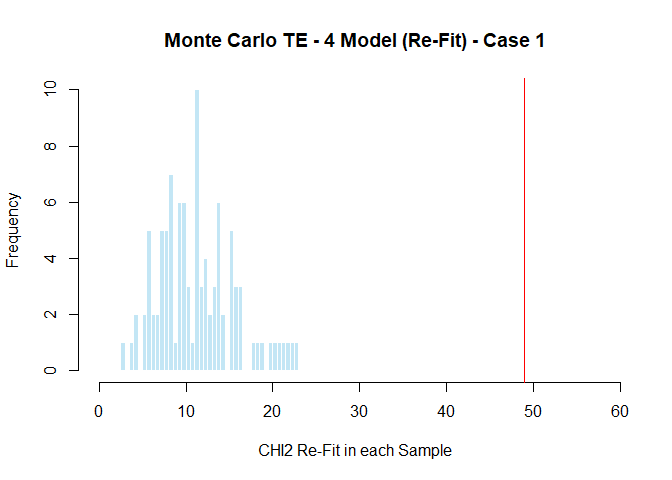
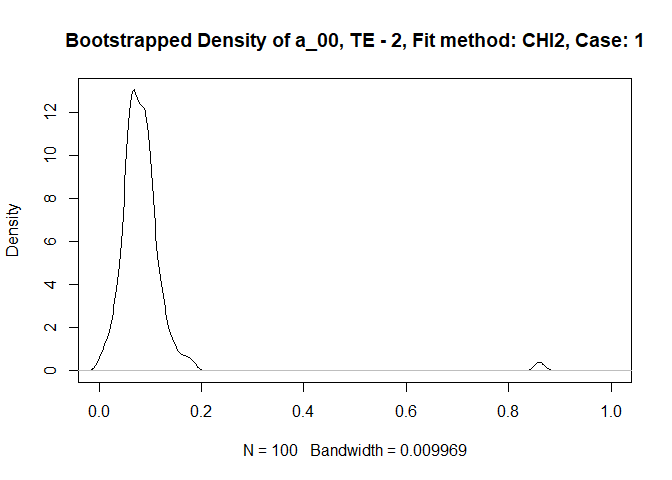

TE\_example
================

**Example set-up: The user can revise this section**
====================================================

**This section illustrates use of the functions**
-------------------------------------------------

Additional documentation of the main functions at the top of the **TEMAP2\_functions.R**

``` r
library(readxl)
library(boot)
library(scales)
library(data.table)
library(ggplot2)
```

**Read in the data**
--------------------

``` r
setwd("C:/Users/edika/Desktop/key backup/Michael") #working directory
source("TEMAP2_only_functions.R")

data_file<-"Example.xlsx"            # Input data are in a xlsx file

read_excel(data_file, sheet = "Inputs")[, c("Inputs", "Specifications")]
```

    ## # A tibble: 28 x 2
    ##    Inputs                             Specifications
    ##    <chr>                              <chr>         
    ##  1 1. Models                          <NA>          
    ##  2 TE-4                               YES           
    ##  3 TE-2                               YES           
    ##  4 TE-1                               YES           
    ##  5 Independence Model                 YES           
    ##  6 <NA>                               <NA>          
    ##  7 2. Fit method                      <NA>          
    ##  8 CHI2 / G2                          CHI2          
    ##  9 <NA>                               <NA>          
    ## 10 3. Parameters for true preferences <NA>          
    ## # ... with 18 more rows

``` r
read_excel(data_file, sheet = "Participant responses")
```

    ## # A tibble: 2 x 17
    ##    Case P0000 P0001 P0010 P0011 P0100 P0101 P0110 P0111 P1000 P1001 P1010
    ##   <dbl> <dbl> <dbl> <dbl> <dbl> <dbl> <dbl> <dbl> <dbl> <dbl> <dbl> <dbl>
    ## 1    1.    4.    8.    2.    0.    4.   43.    2.    8.    1.    0.    2.
    ## 2    2.   31.   17.    4.    7.   25.   56.    3.    9.    3.    3.    4.
    ## # ... with 5 more variables: P1011 <dbl>, P1100 <dbl>, P1101 <dbl>,
    ## #   P1110 <dbl>, P1111 <dbl>

``` r
response_patterns <-read_excel(data_file, sheet = "Participant responses")
number_cases <- nrow(response_patterns)
```

``` r
simulation_results_list <-TE_READ_DATA(data_file)
```

    ## [1] "Fitting True and Error Model TE-4 for case:  1"
    ## [1] "Fitting True and Error Model TE-4 for case:  2"
    ## [1] "Fitting True and Error Model TE-2 for case:  1"
    ## [1] "Fitting True and Error Model TE-2 for case:  2"
    ## [1] "Fitting True and Error Model TE-1 for case:  1"
    ## [1] "Fitting True and Error Model TE-1 for case:  2"
    ## [1] "Performing Monte Carlo simulations of TE-4 for case:  1"
    ## [1] "Performing Monte Carlo simulations of TE-4 for case:  2"
    ## [1] "Performing Monte Carlo simulations of TE-2 for case:  1"
    ## [1] "Performing Monte Carlo simulations of TE-2 for case:  2"
    ## [1] "Performing Monte Carlo simulations of TE-1 for case:  1"
    ## [1] "Performing Monte Carlo simulations of TE-1 for case:  2"
    ## [1] "All values of t are equal to  2e-06 \n Cannot calculate confidence intervals"
    ## [1] "Performing Bootstrap simulations of TE-4 for case:  1"
    ## [1] "All values of t are equal to  2e-06 \n Cannot calculate confidence intervals"
    ## [1] "All values of t are equal to  2e-06 \n Cannot calculate confidence intervals"
    ## [1] "Performing Bootstrap simulations of TE-4 for case:  2"
    ## [1] "Performing Bootstrap simulations of TE-2 for case:  1"
    ## [1] "All values of t are equal to  0.5 \n Cannot calculate confidence intervals"
    ## [1] "Performing Bootstrap simulations of TE-2 for case:  2"
    ## [1] "All values of t are equal to  1e-06 \n Cannot calculate confidence intervals"
    ## [1] "Performing Bootstrap simulations of TE-1 for case:  1"
    ## [1] "All values of t are equal to  2e-06 \n Cannot calculate confidence intervals"
    ## [1] "All values of t are equal to  1e-06 \n Cannot calculate confidence intervals"
    ## [1] "Performing Bootstrap simulations of TE-1 for case:  2"
    ## [1] "Performing Monte Carlo Chi-square (or G2) difference test of selected models for case:  1"
    ## [1] "Performing Monte Carlo Chi-square (or G2) difference test of selected models for case:  2"

``` r
names(simulation_results_list)
```

    ##  [1] "results_TE_1_errors"  "results_TE_2_errors"  "results_TE_4_errors" 
    ##  [4] "results_Independence" "results_TE_4_MC"      "results_TE_2_MC"     
    ##  [7] "results_TE_1_MC"      "results_TE_4_Boot_CI" "results_TE_2_Boot_CI"
    ## [10] "results_TE_1_Boot_CI" "user_restrictions"    "fit_method"          
    ## [13] "results_Chi2_diff_MC" "Output_file"

``` r
(simulation_results_list[[3]])
```

    ## [[1]]
    ## [[1]]$parameters
    ##      Estimates
    ## a_00 0.3321873
    ## a_01 0.0000020
    ## a_10 0.0000020
    ## a_11 0.6678087
    ## 
    ## [[1]]$errors
    ##          Estimates
    ## error_R1 0.2648351
    ## error_R2 0.5000000
    ## error_S1 0.5000000
    ## error_S2 0.0475870
    ## 
    ## [[1]]$chisq
    ##   Chi2 statistic
    ## 1       48.96142
    ## 
    ## [[1]]$p.value
    ##   p value, DF= 10
    ## 1    4.140088e-07
    ## 
    ## [[1]]$contrast.of.proportions
    ##       Observed proportions Predicted TE proportions
    ## P0000          0.037383178               0.04526231
    ## P0001          0.074766355               0.05245097
    ## P0010          0.018691589               0.01654720
    ## P0011          0.000000000               0.02373584
    ## P0100          0.037383178               0.05245097
    ## P0101          0.401869159               0.19632594
    ## P0110          0.018691589               0.02373584
    ## P0111          0.074766355               0.16761021
    ## P1000          0.009345794               0.01654720
    ## P1001          0.000000000               0.02373584
    ## P1010          0.018691589               0.00620290
    ## P1011          0.037383178               0.01339153
    ## P1100          0.009345794               0.02373584
    ## P1101          0.093457944               0.16761021
    ## P1110          0.000000000               0.01339153
    ## P1111          0.168224299               0.15726568
    ## 
    ## [[1]]$contrast.of.frequencies
    ##       Observed frequencies Predicted TE frequencies
    ## P0000                    4                4.8430667
    ## P0001                    8                5.6122539
    ## P0010                    2                1.7705506
    ## P0011                    0                2.5397346
    ## P0100                    4                5.6122539
    ## P0101                   43               21.0068757
    ## P0110                    2                2.5397346
    ## P0111                    8               17.9342926
    ## P1000                    1                1.7705506
    ## P1001                    0                2.5397346
    ## P1010                    2                0.6637103
    ## P1011                    4                1.4328932
    ## P1100                    1                2.5397346
    ## P1101                   10               17.9342926
    ## P1110                    0                1.4328932
    ## P1111                   18               16.8274283
    ## 
    ## [[1]]$matrix.contrast.frequencies
    ## [[1]]$matrix.contrast.frequencies$matrix.of.frequencies
    ##                  Replication2_RR' Replication2_RS' Replication2_SR'
    ## Replication1_RR'                4                8                2
    ## Replication1_RS'                4               43                2
    ## Replication1_SR'                1                0                2
    ## Replication1_SS'                1               10                0
    ##                  Replication2_SS'
    ## Replication1_RR'                0
    ## Replication1_RS'                8
    ## Replication1_SR'                4
    ## Replication1_SS'               18
    ## 
    ## [[1]]$matrix.contrast.frequencies$matrix.of.TE.predictions
    ##                  Replication2_RR' Replication2_RS' Replication2_SR'
    ## Replication1_RR'         4.843067         5.612254        1.7705506
    ## Replication1_RS'         5.612254        21.006876        2.5397346
    ## Replication1_SR'         1.770551         2.539735        0.6637103
    ## Replication1_SS'         2.539735        17.934293        1.4328932
    ##                  Replication2_SS'
    ## Replication1_RR'         2.539735
    ## Replication1_RS'        17.934293
    ## Replication1_SR'         1.432893
    ## Replication1_SS'        16.827428
    ## 
    ## 
    ## 
    ## [[2]]
    ## [[2]]$parameters
    ##      Estimates
    ## a_00 0.7783566
    ## a_01 0.0000020
    ## a_10 0.0000020
    ## a_11 0.2216394
    ## 
    ## [[2]]$errors
    ##            Estimates
    ## error_R1 0.186135487
    ## error_R2 0.500000000
    ## error_S1 0.500000000
    ## error_S2 0.004332523
    ## 
    ## [[2]]$chisq
    ##   Chi2 statistic
    ## 1       31.16442
    ## 
    ## [[2]]$p.value
    ##   p value, DF= 10
    ## 1    0.0005511377
    ## 
    ## [[2]]$contrast.of.proportions
    ##       Observed proportions Predicted TE proportions
    ## P0000          0.155778894              0.128892247
    ## P0001          0.085427136              0.129130237
    ## P0010          0.020100503              0.029479296
    ## P0011          0.035175879              0.029717281
    ## P0100          0.125628141              0.129130237
    ## P0101          0.281407035              0.183823271
    ## P0110          0.015075377              0.029717281
    ## P0111          0.045226131              0.084409306
    ## P1000          0.015075377              0.029479296
    ## P1001          0.015075377              0.029717281
    ## P1010          0.020100503              0.006742983
    ## P1011          0.005025126              0.006980967
    ## P1100          0.025125628              0.029717281
    ## P1101          0.070351759              0.084409306
    ## P1110          0.015075377              0.006980967
    ## P1111          0.070351759              0.061672762
    ## 
    ## [[2]]$contrast.of.frequencies
    ##       Observed frequencies Predicted TE frequencies
    ## P0000                   31                25.649557
    ## P0001                   17                25.696917
    ## P0010                    4                 5.866380
    ## P0011                    7                 5.913739
    ## P0100                   25                25.696917
    ## P0101                   56                36.580831
    ## P0110                    3                 5.913739
    ## P0111                    9                16.797452
    ## P1000                    3                 5.866380
    ## P1001                    3                 5.913739
    ## P1010                    4                 1.341854
    ## P1011                    1                 1.389212
    ## P1100                    5                 5.913739
    ## P1101                   14                16.797452
    ## P1110                    3                 1.389212
    ## P1111                   14                12.272880
    ## 
    ## [[2]]$matrix.contrast.frequencies
    ## [[2]]$matrix.contrast.frequencies$matrix.of.frequencies
    ##                  Replication2_RR' Replication2_RS' Replication2_SR'
    ## Replication1_RR'               31               17                4
    ## Replication1_RS'               25               56                3
    ## Replication1_SR'                3                3                4
    ## Replication1_SS'                5               14                3
    ##                  Replication2_SS'
    ## Replication1_RR'                7
    ## Replication1_RS'                9
    ## Replication1_SR'                1
    ## Replication1_SS'               14
    ## 
    ## [[2]]$matrix.contrast.frequencies$matrix.of.TE.predictions
    ##                  Replication2_RR' Replication2_RS' Replication2_SR'
    ## Replication1_RR'        25.649557        25.696917         5.866380
    ## Replication1_RS'        25.696917        36.580831         5.913739
    ## Replication1_SR'         5.866380         5.913739         1.341854
    ## Replication1_SS'         5.913739        16.797452         1.389212
    ##                  Replication2_SS'
    ## Replication1_RR'         5.913739
    ## Replication1_RS'        16.797452
    ## Replication1_SR'         1.389212
    ## Replication1_SS'        12.272880

``` r
output_file<- paste(simulation_results_list$Output_file,".txt", sep = "")
(fit_method <- simulation_results_list$fit_method)
```

    ## [1] "CHI2"

``` r
#   It may take 20 min. per case to simulate TE model and analyze 10,000 samples via MC


#   Output is directed to the file designated below

#sink(output_file,append=TRUE)
label_TE_4_errors=c("OUTPUT >>> True and Error Model Results - 4 error terms >>>")
label_TE_2_errors=c("OUTPUT >>> True and Error Model Results - 2 error terms >>>")
label_TE_1_errors=c("OUTPUT >>> True and Error Model Results - 1 error term >>>")
label_Indep=c("OUTPUT >>> Independence Model Results")

print(label_TE_4_errors)
```

    ## [1] "OUTPUT >>> True and Error Model Results - 4 error terms >>>"

``` r
print(simulation_results_list$results_TE_4_errors)
```

    ## [[1]]
    ## [[1]]$parameters
    ##      Estimates
    ## a_00 0.3321873
    ## a_01 0.0000020
    ## a_10 0.0000020
    ## a_11 0.6678087
    ## 
    ## [[1]]$errors
    ##          Estimates
    ## error_R1 0.2648351
    ## error_R2 0.5000000
    ## error_S1 0.5000000
    ## error_S2 0.0475870
    ## 
    ## [[1]]$chisq
    ##   Chi2 statistic
    ## 1       48.96142
    ## 
    ## [[1]]$p.value
    ##   p value, DF= 10
    ## 1    4.140088e-07
    ## 
    ## [[1]]$contrast.of.proportions
    ##       Observed proportions Predicted TE proportions
    ## P0000          0.037383178               0.04526231
    ## P0001          0.074766355               0.05245097
    ## P0010          0.018691589               0.01654720
    ## P0011          0.000000000               0.02373584
    ## P0100          0.037383178               0.05245097
    ## P0101          0.401869159               0.19632594
    ## P0110          0.018691589               0.02373584
    ## P0111          0.074766355               0.16761021
    ## P1000          0.009345794               0.01654720
    ## P1001          0.000000000               0.02373584
    ## P1010          0.018691589               0.00620290
    ## P1011          0.037383178               0.01339153
    ## P1100          0.009345794               0.02373584
    ## P1101          0.093457944               0.16761021
    ## P1110          0.000000000               0.01339153
    ## P1111          0.168224299               0.15726568
    ## 
    ## [[1]]$contrast.of.frequencies
    ##       Observed frequencies Predicted TE frequencies
    ## P0000                    4                4.8430667
    ## P0001                    8                5.6122539
    ## P0010                    2                1.7705506
    ## P0011                    0                2.5397346
    ## P0100                    4                5.6122539
    ## P0101                   43               21.0068757
    ## P0110                    2                2.5397346
    ## P0111                    8               17.9342926
    ## P1000                    1                1.7705506
    ## P1001                    0                2.5397346
    ## P1010                    2                0.6637103
    ## P1011                    4                1.4328932
    ## P1100                    1                2.5397346
    ## P1101                   10               17.9342926
    ## P1110                    0                1.4328932
    ## P1111                   18               16.8274283
    ## 
    ## [[1]]$matrix.contrast.frequencies
    ## [[1]]$matrix.contrast.frequencies$matrix.of.frequencies
    ##                  Replication2_RR' Replication2_RS' Replication2_SR'
    ## Replication1_RR'                4                8                2
    ## Replication1_RS'                4               43                2
    ## Replication1_SR'                1                0                2
    ## Replication1_SS'                1               10                0
    ##                  Replication2_SS'
    ## Replication1_RR'                0
    ## Replication1_RS'                8
    ## Replication1_SR'                4
    ## Replication1_SS'               18
    ## 
    ## [[1]]$matrix.contrast.frequencies$matrix.of.TE.predictions
    ##                  Replication2_RR' Replication2_RS' Replication2_SR'
    ## Replication1_RR'         4.843067         5.612254        1.7705506
    ## Replication1_RS'         5.612254        21.006876        2.5397346
    ## Replication1_SR'         1.770551         2.539735        0.6637103
    ## Replication1_SS'         2.539735        17.934293        1.4328932
    ##                  Replication2_SS'
    ## Replication1_RR'         2.539735
    ## Replication1_RS'        17.934293
    ## Replication1_SR'         1.432893
    ## Replication1_SS'        16.827428
    ## 
    ## 
    ## 
    ## [[2]]
    ## [[2]]$parameters
    ##      Estimates
    ## a_00 0.7783566
    ## a_01 0.0000020
    ## a_10 0.0000020
    ## a_11 0.2216394
    ## 
    ## [[2]]$errors
    ##            Estimates
    ## error_R1 0.186135487
    ## error_R2 0.500000000
    ## error_S1 0.500000000
    ## error_S2 0.004332523
    ## 
    ## [[2]]$chisq
    ##   Chi2 statistic
    ## 1       31.16442
    ## 
    ## [[2]]$p.value
    ##   p value, DF= 10
    ## 1    0.0005511377
    ## 
    ## [[2]]$contrast.of.proportions
    ##       Observed proportions Predicted TE proportions
    ## P0000          0.155778894              0.128892247
    ## P0001          0.085427136              0.129130237
    ## P0010          0.020100503              0.029479296
    ## P0011          0.035175879              0.029717281
    ## P0100          0.125628141              0.129130237
    ## P0101          0.281407035              0.183823271
    ## P0110          0.015075377              0.029717281
    ## P0111          0.045226131              0.084409306
    ## P1000          0.015075377              0.029479296
    ## P1001          0.015075377              0.029717281
    ## P1010          0.020100503              0.006742983
    ## P1011          0.005025126              0.006980967
    ## P1100          0.025125628              0.029717281
    ## P1101          0.070351759              0.084409306
    ## P1110          0.015075377              0.006980967
    ## P1111          0.070351759              0.061672762
    ## 
    ## [[2]]$contrast.of.frequencies
    ##       Observed frequencies Predicted TE frequencies
    ## P0000                   31                25.649557
    ## P0001                   17                25.696917
    ## P0010                    4                 5.866380
    ## P0011                    7                 5.913739
    ## P0100                   25                25.696917
    ## P0101                   56                36.580831
    ## P0110                    3                 5.913739
    ## P0111                    9                16.797452
    ## P1000                    3                 5.866380
    ## P1001                    3                 5.913739
    ## P1010                    4                 1.341854
    ## P1011                    1                 1.389212
    ## P1100                    5                 5.913739
    ## P1101                   14                16.797452
    ## P1110                    3                 1.389212
    ## P1111                   14                12.272880
    ## 
    ## [[2]]$matrix.contrast.frequencies
    ## [[2]]$matrix.contrast.frequencies$matrix.of.frequencies
    ##                  Replication2_RR' Replication2_RS' Replication2_SR'
    ## Replication1_RR'               31               17                4
    ## Replication1_RS'               25               56                3
    ## Replication1_SR'                3                3                4
    ## Replication1_SS'                5               14                3
    ##                  Replication2_SS'
    ## Replication1_RR'                7
    ## Replication1_RS'                9
    ## Replication1_SR'                1
    ## Replication1_SS'               14
    ## 
    ## [[2]]$matrix.contrast.frequencies$matrix.of.TE.predictions
    ##                  Replication2_RR' Replication2_RS' Replication2_SR'
    ## Replication1_RR'        25.649557        25.696917         5.866380
    ## Replication1_RS'        25.696917        36.580831         5.913739
    ## Replication1_SR'         5.866380         5.913739         1.341854
    ## Replication1_SS'         5.913739        16.797452         1.389212
    ##                  Replication2_SS'
    ## Replication1_RR'         5.913739
    ## Replication1_RS'        16.797452
    ## Replication1_SR'         1.389212
    ## Replication1_SS'        12.272880

``` r
print(label_TE_2_errors)
```

    ## [1] "OUTPUT >>> True and Error Model Results - 2 error terms >>>"

``` r
print(simulation_results_list$results_TE_2_errors)
```

    ## [[1]]
    ## [[1]]$parameters
    ##         Estimates
    ## a_00 7.849736e-02
    ## a_01 1.000000e-06
    ## a_10 1.999999e-06
    ## a_11 9.214996e-01
    ## 
    ## [[1]]$errors
    ##         Estimates
    ## error_1 0.5000000
    ## error_2 0.1194666
    ## 
    ## [[1]]$chisq
    ##   Chi2 statistic
    ## 1       63.60579
    ## 
    ## [[1]]$p.value
    ##   p value, DF= 12
    ## 1    4.929884e-09
    ## 
    ## [[1]]$contrast.of.proportions
    ##       Observed proportions Predicted TE proportions
    ## P0000          0.037383178               0.01850388
    ## P0001          0.074766355               0.02629858
    ## P0010          0.018691589               0.01850388
    ## P0011          0.000000000               0.02629858
    ## P0100          0.037383178               0.02629858
    ## P0101          0.401869159               0.17889896
    ## P0110          0.018691589               0.02629858
    ## P0111          0.074766355               0.17889896
    ## P1000          0.009345794               0.01850388
    ## P1001          0.000000000               0.02629858
    ## P1010          0.018691589               0.01850388
    ## P1011          0.037383178               0.02629858
    ## P1100          0.009345794               0.02629858
    ## P1101          0.093457944               0.17889896
    ## P1110          0.000000000               0.02629858
    ## P1111          0.168224299               0.17889896
    ## 
    ## [[1]]$contrast.of.frequencies
    ##       Observed frequencies Predicted TE frequencies
    ## P0000                    4                 1.979915
    ## P0001                    8                 2.813948
    ## P0010                    2                 1.979915
    ## P0011                    0                 2.813948
    ## P0100                    4                 2.813948
    ## P0101                   43                19.142189
    ## P0110                    2                 2.813948
    ## P0111                    8                19.142189
    ## P1000                    1                 1.979915
    ## P1001                    0                 2.813948
    ## P1010                    2                 1.979915
    ## P1011                    4                 2.813948
    ## P1100                    1                 2.813948
    ## P1101                   10                19.142189
    ## P1110                    0                 2.813948
    ## P1111                   18                19.142189
    ## 
    ## [[1]]$matrix.contrast.frequencies
    ## [[1]]$matrix.contrast.frequencies$matrix.of.frequencies
    ##                  Replication2_RR' Replication2_RS' Replication2_SR'
    ## Replication1_RR'                4                8                2
    ## Replication1_RS'                4               43                2
    ## Replication1_SR'                1                0                2
    ## Replication1_SS'                1               10                0
    ##                  Replication2_SS'
    ## Replication1_RR'                0
    ## Replication1_RS'                8
    ## Replication1_SR'                4
    ## Replication1_SS'               18
    ## 
    ## [[1]]$matrix.contrast.frequencies$matrix.of.TE.predictions
    ##                  Replication2_RR' Replication2_RS' Replication2_SR'
    ## Replication1_RR'         1.979915         2.813948         1.979915
    ## Replication1_RS'         2.813948        19.142189         2.813948
    ## Replication1_SR'         1.979915         2.813948         1.979915
    ## Replication1_SS'         2.813948        19.142189         2.813948
    ##                  Replication2_SS'
    ## Replication1_RR'         2.813948
    ## Replication1_RS'        19.142189
    ## Replication1_SR'         2.813948
    ## Replication1_SS'        19.142189
    ## 
    ## 
    ## 
    ## [[2]]
    ## [[2]]$parameters
    ##      Estimates
    ## a_00 0.8451622
    ## a_01 0.0000020
    ## a_10 0.0000010
    ## a_11 0.1548348
    ## 
    ## [[2]]$errors
    ##         Estimates
    ## error_1 0.1441661
    ## error_2 0.5000000
    ## 
    ## [[2]]$chisq
    ##   Chi2 statistic
    ## 1       61.12473
    ## 
    ## [[2]]$p.value
    ##   p value, DF= 12
    ## 1    1.406795e-08
    ## 
    ## [[2]]$contrast.of.proportions
    ##       Observed proportions Predicted TE proportions
    ## P0000          0.155778894               0.15556501
    ## P0001          0.085427136               0.15556501
    ## P0010          0.020100503               0.03084555
    ## P0011          0.035175879               0.03084555
    ## P0100          0.125628141               0.15556501
    ## P0101          0.281407035               0.15556501
    ## P0110          0.015075377               0.03084555
    ## P0111          0.045226131               0.03084555
    ## P1000          0.015075377               0.03084555
    ## P1001          0.015075377               0.03084555
    ## P1010          0.020100503               0.03274388
    ## P1011          0.005025126               0.03274388
    ## P1100          0.025125628               0.03084555
    ## P1101          0.070351759               0.03084555
    ## P1110          0.015075377               0.03274388
    ## P1111          0.070351759               0.03274388
    ## 
    ## [[2]]$contrast.of.frequencies
    ##       Observed frequencies Predicted TE frequencies
    ## P0000                   31                30.957438
    ## P0001                   17                30.957438
    ## P0010                    4                 6.138265
    ## P0011                    7                 6.138265
    ## P0100                   25                30.957438
    ## P0101                   56                30.957438
    ## P0110                    3                 6.138265
    ## P0111                    9                 6.138265
    ## P1000                    3                 6.138265
    ## P1001                    3                 6.138265
    ## P1010                    4                 6.516032
    ## P1011                    1                 6.516032
    ## P1100                    5                 6.138265
    ## P1101                   14                 6.138265
    ## P1110                    3                 6.516032
    ## P1111                   14                 6.516032
    ## 
    ## [[2]]$matrix.contrast.frequencies
    ## [[2]]$matrix.contrast.frequencies$matrix.of.frequencies
    ##                  Replication2_RR' Replication2_RS' Replication2_SR'
    ## Replication1_RR'               31               17                4
    ## Replication1_RS'               25               56                3
    ## Replication1_SR'                3                3                4
    ## Replication1_SS'                5               14                3
    ##                  Replication2_SS'
    ## Replication1_RR'                7
    ## Replication1_RS'                9
    ## Replication1_SR'                1
    ## Replication1_SS'               14
    ## 
    ## [[2]]$matrix.contrast.frequencies$matrix.of.TE.predictions
    ##                  Replication2_RR' Replication2_RS' Replication2_SR'
    ## Replication1_RR'        30.957438        30.957438         6.138265
    ## Replication1_RS'        30.957438        30.957438         6.138265
    ## Replication1_SR'         6.138265         6.138265         6.516032
    ## Replication1_SS'         6.138265         6.138265         6.516032
    ##                  Replication2_SS'
    ## Replication1_RR'         6.138265
    ## Replication1_RS'         6.138265
    ## Replication1_SR'         6.516032
    ## Replication1_SS'         6.516032

``` r
print(label_TE_1_errors)
```

    ## [1] "OUTPUT >>> True and Error Model Results - 1 error term >>>"

``` r
print(simulation_results_list$results_TE_1_errors)
```

    ## [[1]]
    ## [[1]]$parameters
    ##      Estimates
    ## a_00  0.000001
    ## a_01  0.000002
    ## a_10  0.000001
    ## a_11  0.999996
    ## 
    ## [[1]]$errors
    ##       Estimates
    ## error 0.4528992
    ## 
    ## [[1]]$chisq
    ##   Chi2 statistic
    ## 1       251.4935
    ## 
    ## [[1]]$p.value
    ##   p value, DF= 13
    ## 1               0
    ## 
    ## [[1]]$contrast.of.proportions
    ##       Observed proportions Predicted TE proportions
    ## P0000          0.037383178               0.04207336
    ## P0001          0.074766355               0.05082443
    ## P0010          0.018691589               0.05082441
    ## P0011          0.000000000               0.06139568
    ## P0100          0.037383178               0.05082443
    ## P0101          0.401869159               0.06139571
    ## P0110          0.018691589               0.06139568
    ## P0111          0.074766355               0.07416575
    ## P1000          0.009345794               0.05082441
    ## P1001          0.000000000               0.06139568
    ## P1010          0.018691589               0.06139567
    ## P1011          0.037383178               0.07416572
    ## P1100          0.009345794               0.06139568
    ## P1101          0.093457944               0.07416575
    ## P1110          0.000000000               0.07416572
    ## P1111          0.168224299               0.08959192
    ## 
    ## [[1]]$contrast.of.frequencies
    ##       Observed frequencies Predicted TE frequencies
    ## P0000                    4                 4.501849
    ## P0001                    8                 5.438214
    ## P0010                    2                 5.438212
    ## P0011                    0                 6.569337
    ## P0100                    4                 5.438214
    ## P0101                   43                 6.569341
    ## P0110                    2                 6.569337
    ## P0111                    8                 7.935735
    ## P1000                    1                 5.438212
    ## P1001                    0                 6.569337
    ## P1010                    2                 6.569336
    ## P1011                    4                 7.935732
    ## P1100                    1                 6.569337
    ## P1101                   10                 7.935735
    ## P1110                    0                 7.935732
    ## P1111                   18                 9.586336
    ## 
    ## [[1]]$matrix.contrast.frequencies
    ## [[1]]$matrix.contrast.frequencies$matrix.of.frequencies
    ##                  Replication2_RR' Replication2_RS' Replication2_SR'
    ## Replication1_RR'                4                8                2
    ## Replication1_RS'                4               43                2
    ## Replication1_SR'                1                0                2
    ## Replication1_SS'                1               10                0
    ##                  Replication2_SS'
    ## Replication1_RR'                0
    ## Replication1_RS'                8
    ## Replication1_SR'                4
    ## Replication1_SS'               18
    ## 
    ## [[1]]$matrix.contrast.frequencies$matrix.of.TE.predictions
    ##                  Replication2_RR' Replication2_RS' Replication2_SR'
    ## Replication1_RR'         4.501849         5.438214         5.438212
    ## Replication1_RS'         5.438214         6.569341         6.569337
    ## Replication1_SR'         5.438212         6.569337         6.569336
    ## Replication1_SS'         6.569337         7.935735         7.935732
    ##                  Replication2_SS'
    ## Replication1_RR'         6.569337
    ## Replication1_RS'         7.935735
    ## Replication1_SR'         7.935732
    ## Replication1_SS'         9.586336
    ## 
    ## 
    ## 
    ## [[2]]
    ## [[2]]$parameters
    ##      Estimates
    ## a_00  0.999996
    ## a_01  0.000002
    ## a_10  0.000001
    ## a_11  0.000001
    ## 
    ## [[2]]$errors
    ##       Estimates
    ## error 0.4485279
    ## 
    ## [[2]]$chisq
    ##   Chi2 statistic
    ## 1        235.699
    ## 
    ## [[2]]$p.value
    ##   p value, DF= 13
    ## 1               0
    ## 
    ## [[2]]$contrast.of.proportions
    ##       Observed proportions Predicted TE proportions
    ## P0000          0.155778894               0.09248969
    ## P0001          0.085427136               0.07522457
    ## P0010          0.020100503               0.07522455
    ## P0011          0.035175879               0.06118233
    ## P0100          0.125628141               0.07522457
    ## P0101          0.281407035               0.06118238
    ## P0110          0.015075377               0.06118233
    ## P0111          0.045226131               0.04976141
    ## P1000          0.015075377               0.07522455
    ## P1001          0.015075377               0.06118233
    ## P1010          0.020100503               0.06118232
    ## P1011          0.005025126               0.04976139
    ## P1100          0.025125628               0.06118233
    ## P1101          0.070351759               0.04976141
    ## P1110          0.015075377               0.04976139
    ## P1111          0.070351759               0.04047243
    ## 
    ## [[2]]$contrast.of.frequencies
    ##       Observed frequencies Predicted TE frequencies
    ## P0000                   31                18.405449
    ## P0001                   17                14.969690
    ## P0010                    4                14.969685
    ## P0011                    7                12.175284
    ## P0100                   25                14.969690
    ## P0101                   56                12.175293
    ## P0110                    3                12.175284
    ## P0111                    9                 9.902521
    ## P1000                    3                14.969685
    ## P1001                    3                12.175284
    ## P1010                    4                12.175282
    ## P1011                    1                 9.902516
    ## P1100                    5                12.175284
    ## P1101                   14                 9.902521
    ## P1110                    3                 9.902516
    ## P1111                   14                 8.054013
    ## 
    ## [[2]]$matrix.contrast.frequencies
    ## [[2]]$matrix.contrast.frequencies$matrix.of.frequencies
    ##                  Replication2_RR' Replication2_RS' Replication2_SR'
    ## Replication1_RR'               31               17                4
    ## Replication1_RS'               25               56                3
    ## Replication1_SR'                3                3                4
    ## Replication1_SS'                5               14                3
    ##                  Replication2_SS'
    ## Replication1_RR'                7
    ## Replication1_RS'                9
    ## Replication1_SR'                1
    ## Replication1_SS'               14
    ## 
    ## [[2]]$matrix.contrast.frequencies$matrix.of.TE.predictions
    ##                  Replication2_RR' Replication2_RS' Replication2_SR'
    ## Replication1_RR'         18.40545        14.969690        14.969685
    ## Replication1_RS'         14.96969        12.175293        12.175284
    ## Replication1_SR'         14.96969        12.175284        12.175282
    ## Replication1_SS'         12.17528         9.902521         9.902516
    ##                  Replication2_SS'
    ## Replication1_RR'        12.175284
    ## Replication1_RS'         9.902521
    ## Replication1_SR'         9.902516
    ## Replication1_SS'         8.054013

``` r
print(label_Indep)
```

    ## [1] "OUTPUT >>> Independence Model Results"

``` r
print(simulation_results_list$results_Independence)
```

    ## [[1]]
    ## [[1]]$chisq
    ## [1] 50.17082
    ## 
    ## [[1]]$Marginal.prob.Independence
    ##                                    [,1]
    ## Marginal.prob.Replication1_R  0.6635514
    ## Marginal.prob.Replication1_S  0.3364486
    ## Marginal.prob.Replication1_R' 0.1962617
    ## Marginal.prob.Replication1_S' 0.8037383
    ## Marginal.prob.Replication2_R  0.6635514
    ## Marginal.prob.Replication2_S  0.3364486
    ## Marginal.prob.Replication2_R' 0.1495327
    ## Marginal.prob.Replication2_S' 0.8504673
    ## 
    ## [[1]]$contrast.of.frequencies
    ##       Observed frequencies Predicted TE frequencies
    ## P0000                    4                1.3826258
    ## P0001                    8                7.8636840
    ## P0010                    2                0.7010497
    ## P0011                    0                3.9872200
    ## P0100                    4                5.6621817
    ## P0101                   43               32.2036582
    ## P0110                    2                2.8709653
    ## P0111                    8               16.3286154
    ## P1000                    1                0.7010497
    ## P1001                    0                3.9872200
    ## P1010                    2                0.3554618
    ## P1011                    4                2.0216890
    ## P1100                    1                2.8709653
    ## P1101                   10               16.3286154
    ## P1110                    0                1.4557007
    ## P1111                   18                8.2792980
    ## 
    ## [[1]]$matrix.contrast.frequencies
    ## [[1]]$matrix.contrast.frequencies$matrix.of.frequencies
    ##                  Replication2_RR' Replication2_RS' Replication2_SR'
    ## Replication1_RR'                4                8                2
    ## Replication1_RS'                4               43                2
    ## Replication1_SR'                1                0                2
    ## Replication1_SS'                1               10                0
    ##                  Replication2_SS'
    ## Replication1_RR'                0
    ## Replication1_RS'                8
    ## Replication1_SR'                4
    ## Replication1_SS'               18
    ## 
    ## [[1]]$matrix.contrast.frequencies$matrix.of.Independence.predictions
    ##                  Replication2_RR' Replication2_RS' Replication2_SR'
    ## Replication1_RR'        1.3826258         7.863684        0.7010497
    ## Replication1_RS'        5.6621817        32.203658        2.8709653
    ## Replication1_SR'        0.7010497         3.987220        0.3554618
    ## Replication1_SS'        2.8709653        16.328615        1.4557007
    ##                  Replication2_SS'
    ## Replication1_RR'         3.987220
    ## Replication1_RS'        16.328615
    ## Replication1_SR'         2.021689
    ## Replication1_SS'         8.279298
    ## 
    ## 
    ## 
    ## [[2]]
    ## [[2]]$chisq
    ## [1] 58.15099
    ## 
    ## [[2]]$Marginal.prob.Independence
    ##                                    [,1]
    ## Marginal.prob.Replication1_R  0.7638191
    ## Marginal.prob.Replication1_S  0.2361809
    ## Marginal.prob.Replication1_R' 0.3517588
    ## Marginal.prob.Replication1_S' 0.6482412
    ## Marginal.prob.Replication2_R  0.7738693
    ## Marginal.prob.Replication2_S  0.2261307
    ## Marginal.prob.Replication2_R' 0.3919598
    ## Marginal.prob.Replication2_S' 0.6080402
    ## 
    ## [[2]]$contrast.of.frequencies
    ##       Observed frequencies Predicted TE frequencies
    ## P0000                   31                16.218016
    ## P0001                   17                25.158717
    ## P0010                    4                 4.739031
    ## P0011                    7                 7.351573
    ## P0100                   25                29.887486
    ## P0101                   56                46.363921
    ## P0110                    3                 8.733356
    ## P0111                    9                13.547899
    ## P1000                    3                 5.014781
    ## P1001                    3                 7.779340
    ## P1010                    4                 1.465358
    ## P1011                    1                 2.273184
    ## P1100                    5                 9.241525
    ## P1101                   14                14.336213
    ## P1110                    3                 2.700446
    ## P1111                   14                 4.189153
    ## 
    ## [[2]]$matrix.contrast.frequencies
    ## [[2]]$matrix.contrast.frequencies$matrix.of.frequencies
    ##                  Replication2_RR' Replication2_RS' Replication2_SR'
    ## Replication1_RR'               31               17                4
    ## Replication1_RS'               25               56                3
    ## Replication1_SR'                3                3                4
    ## Replication1_SS'                5               14                3
    ##                  Replication2_SS'
    ## Replication1_RR'                7
    ## Replication1_RS'                9
    ## Replication1_SR'                1
    ## Replication1_SS'               14
    ## 
    ## [[2]]$matrix.contrast.frequencies$matrix.of.Independence.predictions
    ##                  Replication2_RR' Replication2_RS' Replication2_SR'
    ## Replication1_RR'        16.218016         25.15872         4.739031
    ## Replication1_RS'        29.887486         46.36392         8.733356
    ## Replication1_SR'         5.014781          7.77934         1.465358
    ## Replication1_SS'         9.241525         14.33621         2.700446
    ##                  Replication2_SS'
    ## Replication1_RR'         7.351573
    ## Replication1_RS'        13.547899
    ## Replication1_SR'         2.273184
    ## Replication1_SS'         4.189153

``` r
print("OUTPUT >>> First few samples parameters for Case 1, Model TE-4 >>>") 
```

    ## [1] "OUTPUT >>> First few samples parameters for Case 1, Model TE-4 >>>"

``` r
print(head(simulation_results_list$results_TE_4_MC[[1]]$parameters_Re.fitted.MC))
```

    ##           a_00  a_01  a_10      a_11
    ## [1,] 0.1712021 2e-06 1e-06 0.8287949
    ## [2,] 0.1802167 2e-06 2e-06 0.8197793
    ## [3,] 0.4017802 1e-06 1e-06 0.5982178
    ## [4,] 0.4451306 2e-06 2e-06 0.5548654
    ## [5,] 0.2266210 1e-06 1e-06 0.7733770
    ## [6,] 0.2529802 2e-06 1e-06 0.7470168

``` r
print(head(simulation_results_list$results_TE_4_MC[[1]]$errors_Re.fitted.MC))
```

    ##       error_R1  error_R2  error_S1   error_S2
    ## [1,] 0.2087993 0.3189786 0.5000000 0.14647768
    ## [2,] 0.1656215 0.2556432 0.5000000 0.10292045
    ## [3,] 0.2646921 0.5000000 0.4750452 0.06229184
    ## [4,] 0.3148369 0.4724579 0.4801294 0.00000100
    ## [5,] 0.2469206 0.5000000 0.5000000 0.10469729
    ## [6,] 0.3208883 0.4636866 0.4674064 0.05210566

``` r
print("OUTPUT >>> First few Monte Carlo Re.fitted Chi-squared (or G2) values for Case 1, Model TE-4 >>>") 
```

    ## [1] "OUTPUT >>> First few Monte Carlo Re.fitted Chi-squared (or G2) values for Case 1, Model TE-4 >>>"

``` r
print(head(simulation_results_list$results_TE_4_MC[[1]]$chisq_Re.fitted.MC))
```

    ##      Chi squared statistics of Re-fitted MC
    ## [1,]                               7.843927
    ## [2,]                               9.148066
    ## [3,]                               7.996856
    ## [4,]                               6.762636
    ## [5,]                              14.001549
    ## [6,]                              13.146574

``` r
print("OUTPUT >>> Chi-squared (or G2) difference test for Case 1, for selected models (available when the Monte Carlo test was not selected) >>>") 
```

    ## [1] "OUTPUT >>> Chi-squared (or G2) difference test for Case 1, for selected models (available when the Monte Carlo test was not selected) >>>"

``` r
print(simulation_results_list$results_Chi2_diff_table[[1]]$TE_1_Chi2_diff_test)
```

    ## NULL

``` r
print(simulation_results_list$results_Chi2_diff_table[[1]]$TE_2_Chi2_diff_test)
```

    ## NULL

``` r
print(simulation_results_list$results_Chi2_diff_table[[1]]$TE_4_Chi2_diff_test)
```

    ## NULL

``` r
print("OUTPUT >>> Monte Carlo Chi-squared (or G2) difference test for Case 1, for selected models >>>") 
```

    ## [1] "OUTPUT >>> Monte Carlo Chi-squared (or G2) difference test for Case 1, for selected models >>>"

``` r
print(simulation_results_list$results_Chi2_diff_MC[[1]]$TE_1_Chi2_diff_test)
```

    ## $Chi2_diff_standard
    ##   CHI2  - Restricted Model CHI2  - Unrestricted Model
    ## 1                 251.4935                   9.388984
    ##   Difference in  CHI2  of Restricted and Unrestricted TE p value, DF= 2
    ## 1                                               242.1045              0
    ## 
    ## $Chi2_diff_Re.fitted.MC
    ## $Chi2_diff_Re.fitted.MC$MC_Re.fitted_chi2_diff_results
    ##        CHI2 of Re-fitted MC - Restricted Modell
    ##   [1,]                                17.001568
    ##   [2,]                                17.265812
    ##   [3,]                                16.390679
    ##   [4,]                                 8.542956
    ##   [5,]                                15.751755
    ##   [6,]                                 8.181194
    ##   [7,]                                13.373832
    ##   [8,]                                 9.219045
    ##   [9,]                                 8.526149
    ##  [10,]                                 8.143047
    ##  [11,]                                12.099418
    ##  [12,]                                23.313939
    ##  [13,]                                14.438866
    ##  [14,]                                24.612160
    ##  [15,]                                 5.415122
    ##  [16,]                                10.651146
    ##  [17,]                                 7.346512
    ##  [18,]                                10.092944
    ##  [19,]                                 3.529505
    ##  [20,]                                21.442724
    ##  [21,]                                 8.290535
    ##  [22,]                                21.345210
    ##  [23,]                                14.913377
    ##  [24,]                                19.946220
    ##  [25,]                                10.358345
    ##  [26,]                                18.265420
    ##  [27,]                                17.433946
    ##  [28,]                                20.148784
    ##  [29,]                                22.182774
    ##  [30,]                                18.824818
    ##  [31,]                                 8.580587
    ##  [32,]                                 7.588706
    ##  [33,]                                 6.065693
    ##  [34,]                                 7.350821
    ##  [35,]                                 9.227570
    ##  [36,]                                18.356942
    ##  [37,]                                13.209504
    ##  [38,]                                21.676257
    ##  [39,]                                11.645883
    ##  [40,]                                15.511878
    ##  [41,]                                17.857162
    ##  [42,]                                10.402735
    ##  [43,]                                12.618932
    ##  [44,]                                 6.185680
    ##  [45,]                                16.320570
    ##  [46,]                                10.519596
    ##  [47,]                                10.755769
    ##  [48,]                                 7.994907
    ##  [49,]                                11.900813
    ##  [50,]                                12.495653
    ##  [51,]                                18.308424
    ##  [52,]                                 8.093223
    ##  [53,]                                12.217277
    ##  [54,]                                15.438578
    ##  [55,]                                 5.647516
    ##  [56,]                                 8.046257
    ##  [57,]                                14.078562
    ##  [58,]                                11.610263
    ##  [59,]                                12.291302
    ##  [60,]                                 5.389666
    ##  [61,]                                10.952586
    ##  [62,]                                12.052384
    ##  [63,]                                11.143142
    ##  [64,]                                14.219197
    ##  [65,]                                40.135717
    ##  [66,]                                17.470732
    ##  [67,]                                17.031801
    ##  [68,]                                 6.552153
    ##  [69,]                                10.289027
    ##  [70,]                                21.855651
    ##  [71,]                                 7.647043
    ##  [72,]                                18.026388
    ##  [73,]                                17.426133
    ##  [74,]                                14.958764
    ##  [75,]                                18.275740
    ##  [76,]                                12.107478
    ##  [77,]                                 9.694335
    ##  [78,]                                11.783990
    ##  [79,]                                 9.257614
    ##  [80,]                                 7.773235
    ##  [81,]                                17.381869
    ##  [82,]                                12.663299
    ##  [83,]                                22.885199
    ##  [84,]                                 7.251755
    ##  [85,]                                35.551504
    ##  [86,]                                12.552166
    ##  [87,]                                14.122227
    ##  [88,]                                15.467290
    ##  [89,]                                 6.231964
    ##  [90,]                                12.849714
    ##  [91,]                                 7.848605
    ##  [92,]                                10.863006
    ##  [93,]                                15.652423
    ##  [94,]                                 9.754838
    ##  [95,]                                11.362070
    ##  [96,]                                 7.474688
    ##  [97,]                                10.728242
    ##  [98,]                                25.013519
    ##  [99,]                                40.433616
    ## [100,]                                 9.598713
    ##        CHI2 of Re-fitted MC - Unrestricted Model
    ##   [1,]                                 16.952987
    ##   [2,]                                 15.617197
    ##   [3,]                                 12.447017
    ##   [4,]                                  8.126386
    ##   [5,]                                 15.751755
    ##   [6,]                                  7.866665
    ##   [7,]                                 12.396444
    ##   [8,]                                  9.207097
    ##   [9,]                                  8.426715
    ##  [10,]                                  7.801526
    ##  [11,]                                 10.612141
    ##  [12,]                                 23.313666
    ##  [13,]                                  8.433011
    ##  [14,]                                 22.039906
    ##  [15,]                                  5.325179
    ##  [16,]                                  8.294231
    ##  [17,]                                  5.564820
    ##  [18,]                                  8.416079
    ##  [19,]                                  2.201517
    ##  [20,]                                 20.799358
    ##  [21,]                                  7.431689
    ##  [22,]                                 17.657430
    ##  [23,]                                 13.763141
    ##  [24,]                                 18.036608
    ##  [25,]                                  8.436925
    ##  [26,]                                 18.170901
    ##  [27,]                                 15.644300
    ##  [28,]                                 14.937366
    ##  [29,]                                 22.104156
    ##  [30,]                                 13.929419
    ##  [31,]                                  8.533022
    ##  [32,]                                  5.997103
    ##  [33,]                                  5.926264
    ##  [34,]                                  6.978063
    ##  [35,]                                  8.124872
    ##  [36,]                                 17.086362
    ##  [37,]                                 12.707434
    ##  [38,]                                 21.676256
    ##  [39,]                                  9.746831
    ##  [40,]                                 15.484173
    ##  [41,]                                 17.859813
    ##  [42,]                                 10.053122
    ##  [43,]                                  9.609202
    ##  [44,]                                  5.367735
    ##  [45,]                                 16.320543
    ##  [46,]                                  6.602295
    ##  [47,]                                  7.443439
    ##  [48,]                                  7.978738
    ##  [49,]                                 11.900810
    ##  [50,]                                  6.628725
    ##  [51,]                                 15.425378
    ##  [52,]                                  6.650448
    ##  [53,]                                 11.997966
    ##  [54,]                                 15.438578
    ##  [55,]                                  4.626678
    ##  [56,]                                  7.588171
    ##  [57,]                                 13.042969
    ##  [58,]                                 10.683548
    ##  [59,]                                 11.484264
    ##  [60,]                                  4.171689
    ##  [61,]                                  9.866509
    ##  [62,]                                  7.413357
    ##  [63,]                                  8.032603
    ##  [64,]                                 12.677684
    ##  [65,]                                 40.121906
    ##  [66,]                                 17.470732
    ##  [67,]                                 16.820051
    ##  [68,]                                  5.217508
    ##  [69,]                                 10.289027
    ##  [70,]                                 16.955211
    ##  [71,]                                  6.796960
    ##  [72,]                                 16.855967
    ##  [73,]                                 16.411399
    ##  [74,]                                 11.202229
    ##  [75,]                                 18.232051
    ##  [76,]                                 11.995255
    ##  [77,]                                  7.331550
    ##  [78,]                                 10.721764
    ##  [79,]                                  8.955423
    ##  [80,]                                  7.702963
    ##  [81,]                                 17.209945
    ##  [82,]                                 12.019097
    ##  [83,]                                 13.951342
    ##  [84,]                                  6.802677
    ##  [85,]                                 33.484804
    ##  [86,]                                 12.514953
    ##  [87,]                                 14.093452
    ##  [88,]                                 15.330545
    ##  [89,]                                  6.099673
    ##  [90,]                                  7.237125
    ##  [91,]                                  7.848605
    ##  [92,]                                 10.071201
    ##  [93,]                                 11.877110
    ##  [94,]                                  8.445717
    ##  [95,]                                 11.229691
    ##  [96,]                                  3.916033
    ##  [97,]                                 10.727582
    ##  [98,]                                 24.090946
    ##  [99,]                                 40.433616
    ## [100,]                                  9.355847
    ##        Difference in  CHI2 of Restricted and Unrestricted TE - Re-fitted MC
    ##   [1,]                                                         4.858024e-02
    ##   [2,]                                                         1.648615e+00
    ##   [3,]                                                         3.943662e+00
    ##   [4,]                                                         4.165706e-01
    ##   [5,]                                                         5.972112e-12
    ##   [6,]                                                         3.145293e-01
    ##   [7,]                                                         9.773882e-01
    ##   [8,]                                                         1.194853e-02
    ##   [9,]                                                         9.943345e-02
    ##  [10,]                                                         3.415214e-01
    ##  [11,]                                                         1.487276e+00
    ##  [12,]                                                         2.732847e-04
    ##  [13,]                                                         6.005855e+00
    ##  [14,]                                                         2.572254e+00
    ##  [15,]                                                         8.994313e-02
    ##  [16,]                                                         2.356914e+00
    ##  [17,]                                                         1.781692e+00
    ##  [18,]                                                         1.676866e+00
    ##  [19,]                                                         1.327988e+00
    ##  [20,]                                                         6.433654e-01
    ##  [21,]                                                         8.588465e-01
    ##  [22,]                                                         3.687780e+00
    ##  [23,]                                                         1.150236e+00
    ##  [24,]                                                         1.909612e+00
    ##  [25,]                                                         1.921419e+00
    ##  [26,]                                                         9.451893e-02
    ##  [27,]                                                         1.789646e+00
    ##  [28,]                                                         5.211418e+00
    ##  [29,]                                                         7.861881e-02
    ##  [30,]                                                         4.895399e+00
    ##  [31,]                                                         4.756529e-02
    ##  [32,]                                                         1.591604e+00
    ##  [33,]                                                         1.394295e-01
    ##  [34,]                                                         3.727582e-01
    ##  [35,]                                                         1.102697e+00
    ##  [36,]                                                         1.270579e+00
    ##  [37,]                                                         5.020701e-01
    ##  [38,]                                                         5.508365e-07
    ##  [39,]                                                         1.899052e+00
    ##  [40,]                                                         2.770529e-02
    ##  [41,]                                                        -2.651000e-03
    ##  [42,]                                                         3.496126e-01
    ##  [43,]                                                         3.009730e+00
    ##  [44,]                                                         8.179446e-01
    ##  [45,]                                                         2.745471e-05
    ##  [46,]                                                         3.917301e+00
    ##  [47,]                                                         3.312330e+00
    ##  [48,]                                                         1.616873e-02
    ##  [49,]                                                         2.655688e-06
    ##  [50,]                                                         5.866929e+00
    ##  [51,]                                                         2.883046e+00
    ##  [52,]                                                         1.442775e+00
    ##  [53,]                                                         2.193111e-01
    ##  [54,]                                                        -1.045031e-11
    ##  [55,]                                                         1.020838e+00
    ##  [56,]                                                         4.580853e-01
    ##  [57,]                                                         1.035592e+00
    ##  [58,]                                                         9.267154e-01
    ##  [59,]                                                         8.070380e-01
    ##  [60,]                                                         1.217977e+00
    ##  [61,]                                                         1.086077e+00
    ##  [62,]                                                         4.639026e+00
    ##  [63,]                                                         3.110539e+00
    ##  [64,]                                                         1.541513e+00
    ##  [65,]                                                         1.381068e-02
    ##  [66,]                                                         9.634959e-12
    ##  [67,]                                                         2.117494e-01
    ##  [68,]                                                         1.334645e+00
    ##  [69,]                                                        -1.839704e-09
    ##  [70,]                                                         4.900440e+00
    ##  [71,]                                                         8.500835e-01
    ##  [72,]                                                         1.170421e+00
    ##  [73,]                                                         1.014734e+00
    ##  [74,]                                                         3.756535e+00
    ##  [75,]                                                         4.368874e-02
    ##  [76,]                                                         1.122228e-01
    ##  [77,]                                                         2.362785e+00
    ##  [78,]                                                         1.062226e+00
    ##  [79,]                                                         3.021918e-01
    ##  [80,]                                                         7.027250e-02
    ##  [81,]                                                         1.719240e-01
    ##  [82,]                                                         6.442026e-01
    ##  [83,]                                                         8.933858e+00
    ##  [84,]                                                         4.490779e-01
    ##  [85,]                                                         2.066700e+00
    ##  [86,]                                                         3.721301e-02
    ##  [87,]                                                         2.877504e-02
    ##  [88,]                                                         1.367452e-01
    ##  [89,]                                                         1.322918e-01
    ##  [90,]                                                         5.612589e+00
    ##  [91,]                                                         4.245117e-07
    ##  [92,]                                                         7.918042e-01
    ##  [93,]                                                         3.775313e+00
    ##  [94,]                                                         1.309121e+00
    ##  [95,]                                                         1.323792e-01
    ##  [96,]                                                         3.558655e+00
    ##  [97,]                                                         6.596255e-04
    ##  [98,]                                                         9.225734e-01
    ##  [99,]                                                         8.696333e-11
    ## [100,]                                                         2.428661e-01
    ## 
    ## $Chi2_diff_Re.fitted.MC$MC.p_value
    ## [1] 0

``` r
print(simulation_results_list$results_Chi2_diff_MC[[1]]$TE_2_Chi2_diff_test)
```

    ## $Chi2_diff_standard
    ##   CHI2  - Restricted Model CHI2  - Unrestricted Model
    ## 1                 63.60579                    9.10704
    ##   Difference in  CHI2  of Restricted and Unrestricted TE p value, DF= 2
    ## 1                                               54.49875   1.464717e-12
    ## 
    ## $Chi2_diff_Re.fitted.MC
    ## $Chi2_diff_Re.fitted.MC$MC_Re.fitted_chi2_diff_results
    ##        CHI2 of Re-fitted MC - Restricted Modell
    ##   [1,]                                10.642920
    ##   [2,]                                27.154260
    ##   [3,]                                 6.978675
    ##   [4,]                                 5.560908
    ##   [5,]                                19.371885
    ##   [6,]                                11.021711
    ##   [7,]                                12.317114
    ##   [8,]                                 5.148854
    ##   [9,]                                20.515417
    ##  [10,]                                 9.685611
    ##  [11,]                                 9.183802
    ##  [12,]                                10.478089
    ##  [13,]                                12.038172
    ##  [14,]                                13.361260
    ##  [15,]                                 9.166930
    ##  [16,]                                15.409342
    ##  [17,]                                13.089310
    ##  [18,]                                 9.088476
    ##  [19,]                                13.438174
    ##  [20,]                                 8.672912
    ##  [21,]                                 3.398914
    ##  [22,]                                13.471300
    ##  [23,]                                 9.524806
    ##  [24,]                                15.333137
    ##  [25,]                                 5.347051
    ##  [26,]                                17.853835
    ##  [27,]                                15.965327
    ##  [28,]                                11.964242
    ##  [29,]                                 6.415447
    ##  [30,]                                18.581041
    ##  [31,]                                 7.856838
    ##  [32,]                                 8.422107
    ##  [33,]                                14.514465
    ##  [34,]                                 8.659516
    ##  [35,]                                10.206030
    ##  [36,]                                 7.454304
    ##  [37,]                                13.037662
    ##  [38,]                                 7.955896
    ##  [39,]                                 6.612865
    ##  [40,]                                14.286513
    ##  [41,]                                 9.660819
    ##  [42,]                                 6.672687
    ##  [43,]                                11.580945
    ##  [44,]                                 8.975592
    ##  [45,]                                10.412683
    ##  [46,]                                12.628751
    ##  [47,]                                 6.252275
    ##  [48,]                                 6.917533
    ##  [49,]                                 6.170516
    ##  [50,]                                10.987506
    ##  [51,]                                13.349519
    ##  [52,]                                15.426661
    ##  [53,]                                 9.992809
    ##  [54,]                                16.869453
    ##  [55,]                                 7.731799
    ##  [56,]                                15.859892
    ##  [57,]                                 8.645618
    ##  [58,]                                13.410773
    ##  [59,]                                20.090899
    ##  [60,]                                12.246580
    ##  [61,]                                17.679103
    ##  [62,]                                15.165253
    ##  [63,]                                 7.142806
    ##  [64,]                                13.706179
    ##  [65,]                                10.787248
    ##  [66,]                                15.598580
    ##  [67,]                                10.314196
    ##  [68,]                                12.533012
    ##  [69,]                                16.357903
    ##  [70,]                                 7.534797
    ##  [71,]                                10.049321
    ##  [72,]                                11.042218
    ##  [73,]                                 6.717083
    ##  [74,]                                15.849719
    ##  [75,]                                 8.812126
    ##  [76,]                                 9.440511
    ##  [77,]                                14.723111
    ##  [78,]                                 9.737642
    ##  [79,]                                21.392823
    ##  [80,]                                11.477560
    ##  [81,]                                12.932395
    ##  [82,]                                13.357053
    ##  [83,]                                11.989576
    ##  [84,]                                11.851828
    ##  [85,]                                14.328421
    ##  [86,]                                14.114917
    ##  [87,]                                11.779051
    ##  [88,]                                 9.943124
    ##  [89,]                                19.328151
    ##  [90,]                                19.969401
    ##  [91,]                                 9.513165
    ##  [92,]                                13.100070
    ##  [93,]                                 9.863578
    ##  [94,]                                 8.016260
    ##  [95,]                                14.416281
    ##  [96,]                                15.809885
    ##  [97,]                                 7.424484
    ##  [98,]                                 6.108652
    ##  [99,]                                 7.727694
    ## [100,]                                14.732129
    ##        CHI2 of Re-fitted MC - Unrestricted Model
    ##   [1,]                                 10.191450
    ##   [2,]                                 25.059129
    ##   [3,]                                  4.463582
    ##   [4,]                                  5.217546
    ##   [5,]                                 19.371885
    ##   [6,]                                 10.867189
    ##   [7,]                                 11.126843
    ##   [8,]                                  4.001718
    ##   [9,]                                 11.918910
    ##  [10,]                                  9.682048
    ##  [11,]                                  8.867553
    ##  [12,]                                  9.711216
    ##  [13,]                                 11.212723
    ##  [14,]                                 11.300182
    ##  [15,]                                  8.119636
    ##  [16,]                                 12.173349
    ##  [17,]                                  8.350928
    ##  [18,]                                  6.858312
    ##  [19,]                                 13.385043
    ##  [20,]                                  8.216152
    ##  [21,]                                  3.130835
    ##  [22,]                                 12.136965
    ##  [23,]                                  8.215817
    ##  [24,]                                 15.327570
    ##  [25,]                                  5.335326
    ##  [26,]                                 13.586382
    ##  [27,]                                 14.543104
    ##  [28,]                                 11.564901
    ##  [29,]                                  3.371086
    ##  [30,]                                 14.450058
    ##  [31,]                                  6.780464
    ##  [32,]                                  7.584961
    ##  [33,]                                 14.460069
    ##  [34,]                                  8.659516
    ##  [35,]                                  9.640724
    ##  [36,]                                  7.150935
    ##  [37,]                                 10.208832
    ##  [38,]                                  7.053890
    ##  [39,]                                  6.593726
    ##  [40,]                                 10.816042
    ##  [41,]                                  6.413657
    ##  [42,]                                  6.276003
    ##  [43,]                                  9.100329
    ##  [44,]                                  8.930348
    ##  [45,]                                  9.977483
    ##  [46,]                                 12.600414
    ##  [47,]                                  6.175314
    ##  [48,]                                  6.185085
    ##  [49,]                                  6.170516
    ##  [50,]                                  9.233162
    ##  [51,]                                 11.972254
    ##  [52,]                                 13.815772
    ##  [53,]                                  7.625786
    ##  [54,]                                 16.961136
    ##  [55,]                                  7.310417
    ##  [56,]                                 13.995699
    ##  [57,]                                  8.195752
    ##  [58,]                                 12.212573
    ##  [59,]                                 17.274805
    ##  [60,]                                 12.037826
    ##  [61,]                                 14.660293
    ##  [62,]                                 12.529528
    ##  [63,]                                  5.787650
    ##  [64,]                                  8.996338
    ##  [65,]                                 10.465546
    ##  [66,]                                 13.203020
    ##  [67,]                                  7.939691
    ##  [68,]                                 12.060545
    ##  [69,]                                 16.338848
    ##  [70,]                                  7.463674
    ##  [71,]                                  5.396649
    ##  [72,]                                 11.042218
    ##  [73,]                                  5.808696
    ##  [74,]                                 10.044848
    ##  [75,]                                  7.706937
    ##  [76,]                                  8.744195
    ##  [77,]                                 14.690295
    ##  [78,]                                  9.462215
    ##  [79,]                                 20.653756
    ##  [80,]                                 10.251746
    ##  [81,]                                 12.830579
    ##  [82,]                                  8.235506
    ##  [83,]                                 11.728353
    ##  [84,]                                 10.346268
    ##  [85,]                                 15.000596
    ##  [86,]                                 13.545445
    ##  [87,]                                 10.638818
    ##  [88,]                                  8.625448
    ##  [89,]                                 18.957548
    ##  [90,]                                 14.190005
    ##  [91,]                                  8.230065
    ##  [92,]                                 10.713031
    ##  [93,]                                  9.544163
    ##  [94,]                                  5.585882
    ##  [95,]                                 12.109502
    ##  [96,]                                 15.271501
    ##  [97,]                                  7.352833
    ##  [98,]                                  5.962724
    ##  [99,]                                  7.502075
    ## [100,]                                 11.326415
    ##        Difference in  CHI2 of Restricted and Unrestricted TE - Re-fitted MC
    ##   [1,]                                                         4.514706e-01
    ##   [2,]                                                         2.095131e+00
    ##   [3,]                                                         2.515092e+00
    ##   [4,]                                                         3.433616e-01
    ##   [5,]                                                         1.234865e-08
    ##   [6,]                                                         1.545217e-01
    ##   [7,]                                                         1.190272e+00
    ##   [8,]                                                         1.147136e+00
    ##   [9,]                                                         8.596508e+00
    ##  [10,]                                                         3.563423e-03
    ##  [11,]                                                         3.162488e-01
    ##  [12,]                                                         7.668734e-01
    ##  [13,]                                                         8.254491e-01
    ##  [14,]                                                         2.061078e+00
    ##  [15,]                                                         1.047294e+00
    ##  [16,]                                                         3.235992e+00
    ##  [17,]                                                         4.738382e+00
    ##  [18,]                                                         2.230164e+00
    ##  [19,]                                                         5.313088e-02
    ##  [20,]                                                         4.567608e-01
    ##  [21,]                                                         2.680790e-01
    ##  [22,]                                                         1.334336e+00
    ##  [23,]                                                         1.308989e+00
    ##  [24,]                                                         5.566938e-03
    ##  [25,]                                                         1.172496e-02
    ##  [26,]                                                         4.267453e+00
    ##  [27,]                                                         1.422223e+00
    ##  [28,]                                                         3.993412e-01
    ##  [29,]                                                         3.044361e+00
    ##  [30,]                                                         4.130982e+00
    ##  [31,]                                                         1.076374e+00
    ##  [32,]                                                         8.371460e-01
    ##  [33,]                                                         5.439594e-02
    ##  [34,]                                                        -1.442569e-07
    ##  [35,]                                                         5.653063e-01
    ##  [36,]                                                         3.033690e-01
    ##  [37,]                                                         2.828830e+00
    ##  [38,]                                                         9.020054e-01
    ##  [39,]                                                         1.913906e-02
    ##  [40,]                                                         3.470471e+00
    ##  [41,]                                                         3.247162e+00
    ##  [42,]                                                         3.966843e-01
    ##  [43,]                                                         2.480616e+00
    ##  [44,]                                                         4.524396e-02
    ##  [45,]                                                         4.352004e-01
    ##  [46,]                                                         2.833661e-02
    ##  [47,]                                                         7.696117e-02
    ##  [48,]                                                         7.324477e-01
    ##  [49,]                                                         1.239091e-07
    ##  [50,]                                                         1.754344e+00
    ##  [51,]                                                         1.377265e+00
    ##  [52,]                                                         1.610889e+00
    ##  [53,]                                                         2.367023e+00
    ##  [54,]                                                        -9.168263e-02
    ##  [55,]                                                         4.213818e-01
    ##  [56,]                                                         1.864193e+00
    ##  [57,]                                                         4.498659e-01
    ##  [58,]                                                         1.198199e+00
    ##  [59,]                                                         2.816094e+00
    ##  [60,]                                                         2.087539e-01
    ##  [61,]                                                         3.018810e+00
    ##  [62,]                                                         2.635725e+00
    ##  [63,]                                                         1.355155e+00
    ##  [64,]                                                         4.709841e+00
    ##  [65,]                                                         3.217014e-01
    ##  [66,]                                                         2.395559e+00
    ##  [67,]                                                         2.374505e+00
    ##  [68,]                                                         4.724678e-01
    ##  [69,]                                                         1.905441e-02
    ##  [70,]                                                         7.112330e-02
    ##  [71,]                                                         4.652671e+00
    ##  [72,]                                                         6.318730e-09
    ##  [73,]                                                         9.083872e-01
    ##  [74,]                                                         5.804870e+00
    ##  [75,]                                                         1.105189e+00
    ##  [76,]                                                         6.963156e-01
    ##  [77,]                                                         3.281664e-02
    ##  [78,]                                                         2.754265e-01
    ##  [79,]                                                         7.390679e-01
    ##  [80,]                                                         1.225814e+00
    ##  [81,]                                                         1.018157e-01
    ##  [82,]                                                         5.121546e+00
    ##  [83,]                                                         2.612230e-01
    ##  [84,]                                                         1.505560e+00
    ##  [85,]                                                        -6.721753e-01
    ##  [86,]                                                         5.694723e-01
    ##  [87,]                                                         1.140233e+00
    ##  [88,]                                                         1.317676e+00
    ##  [89,]                                                         3.706030e-01
    ##  [90,]                                                         5.779396e+00
    ##  [91,]                                                         1.283099e+00
    ##  [92,]                                                         2.387038e+00
    ##  [93,]                                                         3.194155e-01
    ##  [94,]                                                         2.430378e+00
    ##  [95,]                                                         2.306779e+00
    ##  [96,]                                                         5.383837e-01
    ##  [97,]                                                         7.165133e-02
    ##  [98,]                                                         1.459277e-01
    ##  [99,]                                                         2.256197e-01
    ## [100,]                                                         3.405714e+00
    ## 
    ## $Chi2_diff_Re.fitted.MC$MC.p_value
    ## [1] 0

``` r
print(simulation_results_list$results_Chi2_diff_MC[[1]]$TE_4_Chi2_diff_test)
```

    ## $Chi2_diff_standard
    ##   CHI2  - Restricted Model CHI2  - Unrestricted Model
    ## 1                 48.96142                   8.675387
    ##   Difference in  CHI2  of Restricted and Unrestricted TE p value, DF= 2
    ## 1                                               40.28603   1.786483e-09
    ## 
    ## $Chi2_diff_Re.fitted.MC
    ## $Chi2_diff_Re.fitted.MC$MC_Re.fitted_chi2_diff_results
    ##        CHI2 of Re-fitted MC - Restricted Modell
    ##   [1,]                                 7.843927
    ##   [2,]                                 9.148066
    ##   [3,]                                 7.996856
    ##   [4,]                                 6.762636
    ##   [5,]                                14.001549
    ##   [6,]                                13.146574
    ##   [7,]                                21.152731
    ##   [8,]                                11.185814
    ##   [9,]                                 5.316195
    ##  [10,]                                11.460048
    ##  [11,]                                15.404864
    ##  [12,]                                 8.050044
    ##  [13,]                                 7.267454
    ##  [14,]                                16.114928
    ##  [15,]                                11.813550
    ##  [16,]                                12.808667
    ##  [17,]                                10.449748
    ##  [18,]                                15.093543
    ##  [19,]                                13.868277
    ##  [20,]                                13.764757
    ##  [21,]                                 5.801463
    ##  [22,]                                11.443112
    ##  [23,]                                15.499543
    ##  [24,]                                16.364581
    ##  [25,]                                 9.969562
    ##  [26,]                                 7.475163
    ##  [27,]                                 8.990385
    ##  [28,]                                 7.040766
    ##  [29,]                                22.564128
    ##  [30,]                                13.679992
    ##  [31,]                                13.397227
    ##  [32,]                                11.359876
    ##  [33,]                                 8.436286
    ##  [34,]                                 9.398331
    ##  [35,]                                15.086996
    ##  [36,]                                18.810633
    ##  [37,]                                12.072484
    ##  [38,]                                 9.797856
    ##  [39,]                                 3.536061
    ##  [40,]                                16.069660
    ##  [41,]                                 6.405122
    ##  [42,]                                 7.984836
    ##  [43,]                                12.151386
    ##  [44,]                                22.011165
    ##  [45,]                                10.281422
    ##  [46,]                                 9.392573
    ##  [47,]                                12.187579
    ##  [48,]                                 8.424142
    ##  [49,]                                 9.524494
    ##  [50,]                                13.879914
    ##  [51,]                                 2.616877
    ##  [52,]                                21.814384
    ##  [53,]                                 8.166071
    ##  [54,]                                15.159410
    ##  [55,]                                13.962518
    ##  [56,]                                 9.033512
    ##  [57,]                                 8.253914
    ##  [58,]                                11.474303
    ##  [59,]                                 9.672497
    ##  [60,]                                 5.935681
    ##  [61,]                                17.555736
    ##  [62,]                                 9.546575
    ##  [63,]                                 6.858009
    ##  [64,]                                15.928242
    ##  [65,]                                 9.644712
    ##  [66,]                                11.359639
    ##  [67,]                                 8.484591
    ##  [68,]                                 5.503469
    ##  [69,]                                19.902089
    ##  [70,]                                10.040508
    ##  [71,]                                11.074047
    ##  [72,]                                 6.244195
    ##  [73,]                                 9.447110
    ##  [74,]                                13.314148
    ##  [75,]                                 7.061353
    ##  [76,]                                11.735823
    ##  [77,]                                12.423204
    ##  [78,]                                15.632863
    ##  [79,]                                20.677781
    ##  [80,]                                 4.469810
    ##  [81,]                                 5.959305
    ##  [82,]                                 8.303141
    ##  [83,]                                14.203183
    ##  [84,]                                20.362303
    ##  [85,]                                10.995808
    ##  [86,]                                15.942292
    ##  [87,]                                12.835521
    ##  [88,]                                 7.263997
    ##  [89,]                                11.132799
    ##  [90,]                                18.077167
    ##  [91,]                                 5.495016
    ##  [92,]                                 5.714041
    ##  [93,]                                 4.169203
    ##  [94,]                                 9.194377
    ##  [95,]                                13.962781
    ##  [96,]                                11.782054
    ##  [97,]                                11.108183
    ##  [98,]                                11.330578
    ##  [99,]                                 7.987023
    ## [100,]                                 7.552638
    ##        CHI2 of Re-fitted MC - Unrestricted Model
    ##   [1,]                                  6.038510
    ##   [2,]                                  8.116642
    ##   [3,]                                  7.996851
    ##   [4,]                                  4.833277
    ##   [5,]                                 14.001547
    ##   [6,]                                 13.136764
    ##   [7,]                                 15.035878
    ##   [8,]                                 11.185811
    ##   [9,]                                  5.316192
    ##  [10,]                                 11.395043
    ##  [11,]                                 12.582361
    ##  [12,]                                  8.035695
    ##  [13,]                                  7.267449
    ##  [14,]                                 16.114924
    ##  [15,]                                  4.629513
    ##  [16,]                                 12.808660
    ##  [17,]                                  5.845982
    ##  [18,]                                 15.056212
    ##  [19,]                                 13.827858
    ##  [20,]                                 11.938079
    ##  [21,]                                  5.801458
    ##  [22,]                                 11.027602
    ##  [23,]                                  9.015850
    ##  [24,]                                 16.364577
    ##  [25,]                                  8.847888
    ##  [26,]                                  7.475158
    ##  [27,]                                  8.990384
    ##  [28,]                                  7.040765
    ##  [29,]                                 14.067585
    ##  [30,]                                 13.679986
    ##  [31,]                                 13.397061
    ##  [32,]                                 11.349365
    ##  [33,]                                  8.429829
    ##  [34,]                                  9.398327
    ##  [35,]                                 12.765563
    ##  [36,]                                 15.726293
    ##  [37,]                                  8.706035
    ##  [38,]                                  6.390450
    ##  [39,]                                  3.082476
    ##  [40,]                                 11.711950
    ##  [41,]                                  6.394311
    ##  [42,]                                  7.583915
    ##  [43,]                                 12.009328
    ##  [44,]                                 21.505928
    ##  [45,]                                  5.554088
    ##  [46,]                                  7.102434
    ##  [47,]                                  9.929773
    ##  [48,]                                  7.826797
    ##  [49,]                                  6.473624
    ##  [50,]                                 13.879911
    ##  [51,]                                  2.478718
    ##  [52,]                                 18.879350
    ##  [53,]                                  5.564333
    ##  [54,]                                 14.127882
    ##  [55,]                                  4.880870
    ##  [56,]                                  9.033507
    ##  [57,]                                  7.900769
    ##  [58,]                                 11.472699
    ##  [59,]                                  7.001731
    ##  [60,]                                  5.935681
    ##  [61,]                                 17.555734
    ##  [62,]                                  9.345303
    ##  [63,]                                  6.723624
    ##  [64,]                                 12.982532
    ##  [65,]                                  9.644702
    ##  [66,]                                 11.147665
    ##  [67,]                                  6.321124
    ##  [68,]                                  5.384728
    ##  [69,]                                 15.211844
    ##  [70,]                                  9.996397
    ##  [71,]                                 10.492438
    ##  [72,]                                  5.091178
    ##  [73,]                                  9.229103
    ##  [74,]                                 11.837508
    ##  [75,]                                  5.775277
    ##  [76,]                                 11.524999
    ##  [77,]                                  9.290018
    ##  [78,]                                 15.068339
    ##  [79,]                                 19.046749
    ##  [80,]                                  3.911371
    ##  [81,]                                  4.343543
    ##  [82,]                                  8.277106
    ##  [83,]                                 10.926475
    ##  [84,]                                 14.020689
    ##  [85,]                                 10.995805
    ##  [86,]                                 13.780090
    ##  [87,]                                 12.794008
    ##  [88,]                                  5.633667
    ##  [89,]                                 11.132793
    ##  [90,]                                 10.788219
    ##  [91,]                                  5.462132
    ##  [92,]                                  5.688344
    ##  [93,]                                  1.940415
    ##  [94,]                                  9.028166
    ##  [95,]                                 13.962772
    ##  [96,]                                  8.832865
    ##  [97,]                                  8.737821
    ##  [98,]                                 10.024609
    ##  [99,]                                  7.987015
    ## [100,]                                  7.552634
    ##        Difference in  CHI2 of Restricted and Unrestricted TE - Re-fitted MC
    ##   [1,]                                                         1.805417e+00
    ##   [2,]                                                         1.031425e+00
    ##   [3,]                                                         4.878006e-06
    ##   [4,]                                                         1.929360e+00
    ##   [5,]                                                         2.461692e-06
    ##   [6,]                                                         9.810000e-03
    ##   [7,]                                                         6.116853e+00
    ##   [8,]                                                         2.860808e-06
    ##   [9,]                                                         2.394181e-06
    ##  [10,]                                                         6.500571e-02
    ##  [11,]                                                         2.822503e+00
    ##  [12,]                                                         1.434965e-02
    ##  [13,]                                                         5.181356e-06
    ##  [14,]                                                         4.611773e-06
    ##  [15,]                                                         7.184037e+00
    ##  [16,]                                                         6.143189e-06
    ##  [17,]                                                         4.603766e+00
    ##  [18,]                                                         3.733139e-02
    ##  [19,]                                                         4.041921e-02
    ##  [20,]                                                         1.826678e+00
    ##  [21,]                                                         5.064484e-06
    ##  [22,]                                                         4.155094e-01
    ##  [23,]                                                         6.483693e+00
    ##  [24,]                                                         4.663036e-06
    ##  [25,]                                                         1.121674e+00
    ##  [26,]                                                         4.219743e-06
    ##  [27,]                                                         7.210814e-07
    ##  [28,]                                                         1.059870e-06
    ##  [29,]                                                         8.496542e+00
    ##  [30,]                                                         5.774753e-06
    ##  [31,]                                                         1.664482e-04
    ##  [32,]                                                         1.051132e-02
    ##  [33,]                                                         6.457190e-03
    ##  [34,]                                                         3.960979e-06
    ##  [35,]                                                         2.321433e+00
    ##  [36,]                                                         3.084340e+00
    ##  [37,]                                                         3.366449e+00
    ##  [38,]                                                         3.407406e+00
    ##  [39,]                                                         4.535858e-01
    ##  [40,]                                                         4.357710e+00
    ##  [41,]                                                         1.081108e-02
    ##  [42,]                                                         4.009205e-01
    ##  [43,]                                                         1.420578e-01
    ##  [44,]                                                         5.052377e-01
    ##  [45,]                                                         4.727334e+00
    ##  [46,]                                                         2.290139e+00
    ##  [47,]                                                         2.257806e+00
    ##  [48,]                                                         5.973454e-01
    ##  [49,]                                                         3.050870e+00
    ##  [50,]                                                         3.220953e-06
    ##  [51,]                                                         1.381590e-01
    ##  [52,]                                                         2.935033e+00
    ##  [53,]                                                         2.601738e+00
    ##  [54,]                                                         1.031527e+00
    ##  [55,]                                                         9.081648e+00
    ##  [56,]                                                         4.799125e-06
    ##  [57,]                                                         3.531451e-01
    ##  [58,]                                                         1.603184e-03
    ##  [59,]                                                         2.670766e+00
    ##  [60,]                                                         2.256691e-07
    ##  [61,]                                                         1.386619e-06
    ##  [62,]                                                         2.012725e-01
    ##  [63,]                                                         1.343854e-01
    ##  [64,]                                                         2.945710e+00
    ##  [65,]                                                         9.502009e-06
    ##  [66,]                                                         2.119746e-01
    ##  [67,]                                                         2.163466e+00
    ##  [68,]                                                         1.187415e-01
    ##  [69,]                                                         4.690245e+00
    ##  [70,]                                                         4.411124e-02
    ##  [71,]                                                         5.816098e-01
    ##  [72,]                                                         1.153017e+00
    ##  [73,]                                                         2.180075e-01
    ##  [74,]                                                         1.476640e+00
    ##  [75,]                                                         1.286076e+00
    ##  [76,]                                                         2.108236e-01
    ##  [77,]                                                         3.133186e+00
    ##  [78,]                                                         5.645241e-01
    ##  [79,]                                                         1.631033e+00
    ##  [80,]                                                         5.584387e-01
    ##  [81,]                                                         1.615762e+00
    ##  [82,]                                                         2.603571e-02
    ##  [83,]                                                         3.276708e+00
    ##  [84,]                                                         6.341614e+00
    ##  [85,]                                                         2.987735e-06
    ##  [86,]                                                         2.162202e+00
    ##  [87,]                                                         4.151249e-02
    ##  [88,]                                                         1.630330e+00
    ##  [89,]                                                         5.896834e-06
    ##  [90,]                                                         7.288947e+00
    ##  [91,]                                                         3.288327e-02
    ##  [92,]                                                         2.569729e-02
    ##  [93,]                                                         2.228788e+00
    ##  [94,]                                                         1.662108e-01
    ##  [95,]                                                         9.175697e-06
    ##  [96,]                                                         2.949189e+00
    ##  [97,]                                                         2.370362e+00
    ##  [98,]                                                         1.305969e+00
    ##  [99,]                                                         7.504417e-06
    ## [100,]                                                         3.617259e-06
    ## 
    ## $Chi2_diff_Re.fitted.MC$MC.p_value
    ## [1] 0

``` r
#sink(file = NULL)
```

**Draw histogram of the fit for the TE-4 Model**
------------------------------------------------

Draw histogram for **Case \#1** TE-4 Model **Refit** to each sample
-------------------------------------------------------------------

Change to 'results\_TE\_2\_MC' for TE-2 model or change to 'results\_TE\_1\_MC' for TE-1 model.

``` r
case=1
if (is.null(simulation_results_list$results_TE_4_MC)==0) {
  #pdf("MonteCarlo_TE_4_Refit_Case_1.pdf")
  MonteCarlo_statistic_histogram <- hist(simulation_results_list$results_TE_4_MC[[case]]$chisq_Re.fitted.MC,col=scales::alpha('skyblue',.5),
                                         breaks=50,xlim = c(0, simulation_results_list$results_TE_4_MC[[case]]$original.chisq[[1]]+10),border=F,
                                         main=paste0("Monte Carlo TE - 4 Model (Re-Fit) - Case ", case),
                                         xlab=paste0(fit_method," Re-Fit in each Sample")) 
  abline(v=simulation_results_list$results_TE_4_MC[[case]]$original.chisq,col="red")
  #dev.off()

}
```



Draw histogram for **Case \#1** TE Model **Conservative** Monte Carlo
---------------------------------------------------------------------

``` r
if (is.null(simulation_results_list$results_TE_4_MC)==0) {

  
  # pdf("MonteCarlo_TE_4_Conservative_Case_1.pdf")
  MonteCarlo_conservative_statistic_histogram <- hist(simulation_results_list$results_TE_4_MC[[case]]$chisq_Conservative.MC,col=scales::alpha('skyblue',.5),
                                                      breaks=50,
                                                      xlim = c(0, simulation_results_list$results_TE_4_MC[[case]]$original.chisq[[1]] +10),
                                                      border=F,
                                                      main=paste0("Monte Carlo TE - 4 Model (Conservative) - Case ", case),
                                                      xlab=paste0(fit_method," Conservative"))
  abline(v=simulation_results_list$results_TE_4_MC[[case]]$original.chisq,col="red")
  #dev.off()
}
```


**Draw histogram of the fit for the TE-2 Model**
------------------------------------------------

Draw Histogram for **Case \#1** TE-2 Model **Refit** to each sample
-------------------------------------------------------------------

Change to 'results\_TE\_2\_MC' for TE-2 model or change to 'results\_TE\_1\_MC' for TE-1 model.

``` r
if (is.null(simulation_results_list$results_TE_2_MC)==0) {
  #pdf("MonteCarlo_TE_2_Refit_Case_1.pdf")
  MonteCarlo_statistic_histogram <- hist(simulation_results_list$results_TE_2_MC[[case]]$chisq_Re.fitted.MC,col=scales::alpha('skyblue',.5),
                                         breaks=50,
                                         xlim = c(0, simulation_results_list$results_TE_2_MC[[case]]$original.chisq[[1]]+10),
                                         border=F,
                                         main=paste0("Monte Carlo TE - 2 Model (Re-Fit) - Case ", case),
                                         xlab=paste0(fit_method," Re-Fit in each Sample")) 
  abline(v=simulation_results_list$results_TE_2_MC[[case]]$original.chisq,col="red")
  #dev.off()
}
```

 \#\# Draw Histogram for **Case \#1** TE Model **Conservative** Monte Carlo

``` r
  if (is.null(simulation_results_list$results_TE_2_MC)==0) {

  #pdf("MonteCarlo_TE_2_Conservative_Case_1.pdf")
  MonteCarlo_conservative_statistic_histogram <- hist(simulation_results_list$results_TE_2_MC[[case]]$chisq_Conservative.MC,col=scales::alpha('skyblue',.5),
                                                      breaks=50,
                                                      xlim = c(0, simulation_results_list$results_TE_2_MC[[case]]$original.chisq[[1]]+10),
                                                      border=F,
                                                      main=paste0("Monte Carlo TE - 2 Model (Conservative) - Case ", case),
                                                      xlab=paste0(fit_method," Conservative")) 
  abline(v=simulation_results_list$results_TE_2_MC[[case]]$original.chisq,col="red")
  #dev.off()
}
```


**Save bootstrapped density GRAPHS for the TE-4 Model**
-------------------------------------------------------

The next section shows how to graph the results of the bootstrapping distributions for Case \#1.

Here smoothed density distributions are drawn. One could use histograms instead.

Note that parameters fixed by the user do not show density distributions.

Change to 'rresults\_TE\_2\_Boot\_CI' for TE-2 model or change to 'results\_TE\_1\_Boot\_CI' for TE-1 model.

``` r
if (is.null(simulation_results_list$results_TE_4_Boot_CI)==0) {
  #pdf("Bootstrapped Density of a_00.pdf")
  plot(density( simulation_results_list$results_TE_4_Boot_CI[[case]]$boot.parameters[,c("a_00")]),xlim = c(0, 1), main=paste0("Bootstrapped Density of a_00, TE - 4, Fit method: ", fit_method, ", Case: ",case))
  #dev.off()
  #pdf("Bootstrapped Density of a_01.pdf")
  plot(density(simulation_results_list$results_TE_4_Boot_CI[[case]]$boot.parameters[,c("a_01")]),xlim = c(0, 1), main=paste0("Bootstrapped Density of a_01, TE - 4, Fit method: ", fit_method, ", Case: ",case))                                               
  #dev.off()
  #pdf("Bootstrapped Density of a_10.pdf")
  plot(density(simulation_results_list$results_TE_4_Boot_CI[[case]]$boot.parameters[,c("a_10")]),xlim = c(0, 1), main=paste0("Bootstrapped Density of a_10, TE - 4, Fit method: ", fit_method, ", Case: ",case))
  #dev.off()
  #pdf("Bootstrapped Density of a_11.pdf")
  plot(density(simulation_results_list$results_TE_4_Boot_CI[[case]]$boot.parameters[,c("a_11")]),xlim = c(0, 1), main=paste0("Bootstrapped Density of a_11, TE - 4, Fit method: ", fit_method, ", Case: ",case))
  #dev.off()
  #pdf("Bootstrapped Density of error_R1.pdf")
  plot(density(simulation_results_list$results_TE_4_Boot_CI[[case]]$boot.errors[,c("error_R1")]),xlim = c(0, 1), main=paste0("Bootstrapped Density of error_R1, TE - 4, Fit method: ", fit_method, ", Case: ",case))
  #dev.off()
  #pdf("Bootstrapped Density of error_R2.pdf")
  plot(density(simulation_results_list$results_TE_4_Boot_CI[[case]]$boot.errors[,c("error_R2")]),xlim = c(0, 1), main=paste0("Bootstrapped Density of error_R2, TE - 4, Fit method: ", fit_method, ", Case: ",case))
  #dev.off()
  #pdf("Bootstrapped Density of error_S1.pdf")
  plot(density(simulation_results_list$results_TE_4_Boot_CI[[case]]$boot.errors[,c("error_S1")]),xlim = c(0, 1), main=paste0("Bootstrapped Density of error_S1, TE - 4, Fit method: ", fit_method, ", Case: ",case))
  #dev.off()
  #pdf("Bootstrapped Density of error_S2.pdf")
  plot(density(simulation_results_list$results_TE_4_Boot_CI[[case]]$boot.errors[,c("error_S2")]),xlim = c(0, 1), main=paste0("Bootstrapped Density of error_S2, TE - 4, Fit method: ", fit_method, ", Case: ",case))
  #dev.off()
}
```


**Save bootstrapped density graphs for the TE-2 Model**
-------------------------------------------------------

The next section shows how to graph the results of the bootstrapping distributions for Case \#1

Here smoothed density distributions are drawn. One could use histograms instead.

Note that parameters fixed by the user do not show density distributions

Change to 'rresults\_TE\_2\_Boot\_CI' for TE-2 model or change to 'results\_TE\_1\_Boot\_CI' for TE-1 model.

``` r
#dev.set(dev.next())
#dev.cur()

if (is.null(simulation_results_list$results_TE_2_Boot_CI)==0) {
  
  #pdf("TE-2 Bootstrapped Density of a_00.pdf")
  plot(( simulation_results_list$results_TE_2_Boot_CI[[1]]$boot.parameters[,c("a_00")]),xlim = c(0, 1), main=paste0("Bootstrapped Density of a_00, TE - 2, Fit method: ", fit_method, ", Case: ",case))
  # dev.off()
  #pdf("TE-2 Bootstrapped Density of a_01.pdf")
  plot(density(simulation_results_list$results_TE_2_Boot_CI[[1]]$boot.parameters[,c("a_01")]),xlim = c(0, 1), main=paste0("Bootstrapped Density of a_01, TE - 2, Fit method: ", fit_method, ", Case: ",case))
  #dev.off()
  #pdf("TE-2 Bootstrapped Density of a_10.pdf")
  plot(density(simulation_results_list$results_TE_2_Boot_CI[[1]]$boot.parameters[,c("a_10")]),xlim = c(0, 1), main=paste0("Bootstrapped Density of a_10, TE - 2, Fit method: ", fit_method, ", Case: ",case))
  #dev.off()
  #pdf("TE-2 Bootstrapped Density of a_11.pdf")
  plot(density(simulation_results_list$results_TE_2_Boot_CI[[1]]$boot.parameters[,c("a_11")]),xlim = c(0, 1), main=paste0("Bootstrapped Density of a_11, TE - 2, Fit method: ", fit_method, ", Case: ",case))
  #dev.off()
  #pdf("TE-2 Bootstrapped Density of error_1.pdf")
  plot(density(simulation_results_list$results_TE_2_Boot_CI[[1]]$boot.errors[,c("error_1")]),xlim = c(0, 1), main=paste0("Bootstrapped Density of error_1, TE - 2, Fit method: ", fit_method, ", Case: ",case))
  #dev.off()
  #pdf("TE-2 Bootstrapped Density of error_2.pdf")
  plot(density(simulation_results_list$results_TE_2_Boot_CI[[1]]$boot.errors[,c("error_2")]),xlim = c(0, 1), main=paste0("Bootstrapped Density of error_2, TE - 2, Fit method: ", fit_method, ", Case: ",case))
  #dev.off()
  
}
```



**Draw histograms of the Chi-squared difference test for the restricted and unrestricted models**
-------------------------------------------------------------------------------------------------

Draw Histogram for **Case \#1** of the Chi-squared difference values for the TE-4 Model
---------------------------------------------------------------------------------------

Change participant in '\[\[case\]\]'.

``` r
TE_4_Re_fit <- simulation_results_list$results_Chi2_diff_MC[[case]]$TE_4_Chi2_diff_test$Chi2_diff_Re.fitted.MC$MC_Re.fitted_chi2_diff_results[,3]
TE_2_Re_fit <- simulation_results_list$results_Chi2_diff_MC[[case]]$TE_2_Chi2_diff_test$Chi2_diff_Re.fitted.MC$MC_Re.fitted_chi2_diff_results[,3]
TE_1_Re_fit <- simulation_results_list$results_Chi2_diff_MC[[case]]$TE_1_Chi2_diff_test$Chi2_diff_Re.fitted.MC$MC_Re.fitted_chi2_diff_results[,3]

TE_4_Standard <- simulation_results_list$results_Chi2_diff_MC[[case]]$TE_4_Chi2_diff_test$Chi2_diff_standard[,3]
TE_2_Standard <- simulation_results_list$results_Chi2_diff_MC[[case]]$TE_2_Chi2_diff_test$Chi2_diff_standard[,3]
TE_1_Standard <- simulation_results_list$results_Chi2_diff_MC[[case]]$TE_1_Chi2_diff_test$Chi2_diff_standard[,3]
```

Adjust the number of breaks for a better display

Negative differences in Chi2 could occur in rare occasions, only when the optimization algorithm reaches local minima points.

``` r
if (is.null(TE_4_Re_fit)==0) {
  #pdf(paste0("MonteCarlo_",fit_method,"_difference_test_TE_4_Refit_Case_",case, ".pdf"))
  MonteCarlo_histogram <- hist(TE_4_Re_fit,col=scales::alpha('skyblue',.5),breaks=30,
                               border=F,
                               main=paste0("Monte Carlo ",fit_method," Difference, TE - 4 Model (Re-Fit)"),
                               xlim = c(-1, TE_4_Standard+4),
                               xlab=paste0(fit_method," Difference (Re-Fit Monte Carlo)"))
  abline(v=TE_4_Standard,col="red")
  #dev.off()
}  
```


``` r
if (is.null(TE_2_Re_fit)==0) {
  #pdf(paste0("MonteCarlo_",fit_method,"_difference_test_TE_2_Refit_Case_",case, ".pdf"))
  MonteCarlo_histogram <- hist(TE_2_Re_fit,col=scales::alpha('skyblue',.5),breaks=30,
                               border=F,
                               main=paste0("Monte Carlo ",fit_method," Difference, TE - 2 Model (Re-Fit)"),
                               xlim = c(-1, TE_2_Standard+4),
                               xlab=paste0(fit_method," Difference (Re-Fit Monte Carlo)"))
  abline(v=TE_2_Standard,col="red")
  #dev.off()
}  
```


This example is set up to save only selected results to illustrate the program

For example, it saves only graphs for the first case.

You can easily revise it to save other information and to make other graphs

See documentation section.

**For profesoor Lee**
=====================

``` r
fit_method <- simulation_results_list$fit_method
if (is.null(simulation_results_list$results_TE_4_Boot_CI)==0) {
  
  file_name <- paste0("Boot sample estimates, TE4, fit method ", fit_method,
                      " restrictions a_00=",simulation_results_list$user_restrictions[1],  
                      " ,a_01=",simulation_results_list$user_restrictions[2],
                      " ,a_10=",simulation_results_list$user_restrictions[3],
                      " ,a_11=",simulation_results_list$user_restrictions[4],
                      ".csv")
  
  boot_estimates_all <- NULL
  for (i in 1:length(simulation_results_list$results_TE_4_Boot_CI)) {
    boot_estimates<- as.data.table(simulation_results_list$results_TE_4_Boot_CI[[i]]$boot.parameters)
    boot_estimates <- cbind(boot_estimates,simulation_results_list$results_TE_4_Boot_CI[[i]]$boot.errors)
    
    boot_estimates[,case:=i]
    
    boot_estimates_all <- rbind(boot_estimates_all, boot_estimates)
  }
  
  write.csv(boot_estimates_all, file= file_name)
  
  
}


if (is.null(simulation_results_list$results_TE_2_Boot_CI)==0) {
  
  
  file_name <- paste0("Boot sample estimates, TE2, fit method ", fit_method, " restrictions a_00=",simulation_results_list$user_restrictions[1],  
                      " ,a_01=",simulation_results_list$user_restrictions[2],
                      " ,a_10=",simulation_results_list$user_restrictions[3],
                      " ,a_11=",simulation_results_list$user_restrictions[4],
                      ".csv")
  
  boot_estimates_all <- NULL
  for (i in 1:length(simulation_results_list$results_TE_2_Boot_CI)) {
    boot_estimates<- as.data.table(simulation_results_list$results_TE_2_Boot_CI[[i]]$boot.parameters)
    boot_estimates <- cbind(boot_estimates,simulation_results_list$results_TE_2_Boot_CI[[i]]$boot.errors)
    
    boot_estimates[,case:=i]
    
    boot_estimates_all <- rbind(boot_estimates_all, boot_estimates)
  }
  
  write.csv(boot_estimates_all, file= file_name)
  
}


if (is.null(simulation_results_list$results_TE_1_Boot_CI)==0) {
  
  
  file_name <- paste0("Boot sample estimates, TE1, fit method ", fit_method, " restrictions a_00=",simulation_results_list$user_restrictions[1],  
                      " ,a_01=",simulation_results_list$user_restrictions[2],
                      " ,a_10=",simulation_results_list$user_restrictions[3],
                      " ,a_11=",simulation_results_list$user_restrictions[4],
                      ".csv")
  
  boot_estimates_all <- NULL
  for (i in 1:length(simulation_results_list$results_TE_1_Boot_CI)) {
    boot_estimates<- as.data.table(simulation_results_list$results_TE_1_Boot_CI[[i]]$boot.parameters)
    boot_estimates <- cbind(boot_estimates,simulation_results_list$results_TE_1_Boot_CI[[i]]$boot.errors)
    
    boot_estimates[,case:=i]
    
    boot_estimates_all <- rbind(boot_estimates_all, boot_estimates)
  }
  
  write.csv(boot_estimates_all, file= file_name)
  
}
```

Plot of confidence intervals
============================

Confidence intervals are ommited for the parameters constrained to be 0 in the input file

``` r
case=1 #select case for graph

CI_plot_TE1 <-NULL
CI_plot_TE2 <-NULL
CI_plot_TE4 <-NULL

if (is.null(simulation_results_list$results_TE_1_Boot_CI)==0) {
  
  CI_plot_TE1<-(simulation_results_list$results_TE_1_Boot_CI[[case]]$confidence.intervals)
  CI_plot_TE1 <-cbind(Parameters=rownames(CI_plot_TE1), CI_plot_TE1)
  CI_plot_TE1 <- as.data.table(CI_plot_TE1)
  CI_plot_TE1[,Estimates:=as.numeric(Estimates)]
  CI_plot_TE1[,`Lower bound`:=as.numeric(`Lower bound`)]
  CI_plot_TE1[,`Upper bound`:=as.numeric(`Upper bound`)]
  CI_plot_TE1[,Model:= "TE1"]
}

if (is.null(simulation_results_list$results_TE_2_Boot_CI)==0) {
  
  
  CI_plot_TE2<-(simulation_results_list$results_TE_2_Boot_CI[[case]]$confidence.intervals)
  CI_plot_TE2<-cbind(Parameters=rownames(CI_plot_TE2), CI_plot_TE2)
  CI_plot_TE2 <- as.data.table(CI_plot_TE2)
  CI_plot_TE2[,Estimates:=as.numeric(Estimates)]
  CI_plot_TE2[,`Lower bound`:=as.numeric(`Lower bound`)]
  CI_plot_TE2[,`Upper bound`:=as.numeric(`Upper bound`)]
  CI_plot_TE2[,Model:= "TE2"]
}

if (is.null(simulation_results_list$results_TE_4_Boot_CI)==0) {
  
  
  CI_plot_TE4<-(simulation_results_list$results_TE_4_Boot_CI[[case]]$confidence.intervals)
  CI_plot_TE4<-cbind(Parameters=rownames(CI_plot_TE4), CI_plot_TE4)
  CI_plot_TE4 <- as.data.table(CI_plot_TE4)
  CI_plot_TE4[,Estimates:=as.numeric(Estimates)]
  CI_plot_TE4[,`Lower bound`:=as.numeric(`Lower bound`)]
  CI_plot_TE4[,`Upper bound`:=as.numeric(`Upper bound`)]
  CI_plot_TE4[,Model:= "TE4"]
}

CI_plot_all <- rbind(CI_plot_TE1, CI_plot_TE2, CI_plot_TE4)

# Make the graph with the 95% confidence interval
if (is.null(CI_plot_all)!=1) {
  
  figure <- ggplot(CI_plot_all, aes(x=Parameters, 
                                    y=Estimates #, group=1
                                    #ymin=CI_plot$`Lower bound`, ymax=CI_plot$`Upper bound`
  )) +
    geom_errorbar(width=.1, aes(ymin=CI_plot_all$`Lower bound`, ymax=CI_plot_all$`Upper bound`)) +
    geom_point(shape=21, size=3, fill="white")  +  coord_flip() +  
    facet_grid( Model~., scales = "free") +
    ggtitle(paste0("Bootstrap CI for TE models; Case ",case," ; Fit method: ", fit_method,
                   ";\nRestrictions: a_00=",simulation_results_list$user_restrictions[1],  
                   ", a_01=",simulation_results_list$user_restrictions[2],
                   ", a_10=",simulation_results_list$user_restrictions[3],
                   ", a_11=",simulation_results_list$user_restrictions[4]
    ))
  ggsave(figure, file= paste0("Bootstrap CI for TE models; Case ",case," ; Fit method= ", fit_method,
                              "; Restrictions a_00=",simulation_results_list$user_restrictions[1],  
                              ", a_01=",simulation_results_list$user_restrictions[2],
                              ", a_10=",simulation_results_list$user_restrictions[3],
                              ", a_11=",simulation_results_list$user_restrictions[4], ".pdf"  ), width=7,height=8)
  figure
}
```

    ## Warning: Removed 2 rows containing missing values (geom_errorbar).

    ## Warning: Removed 2 rows containing missing values (geom_errorbar).


